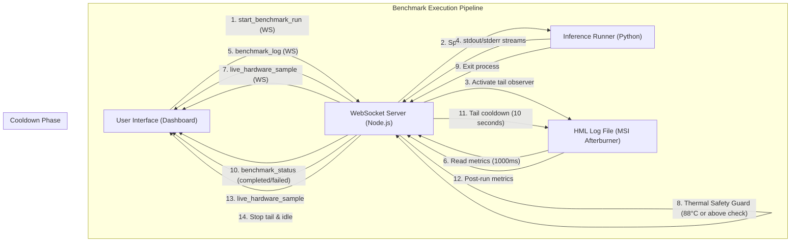
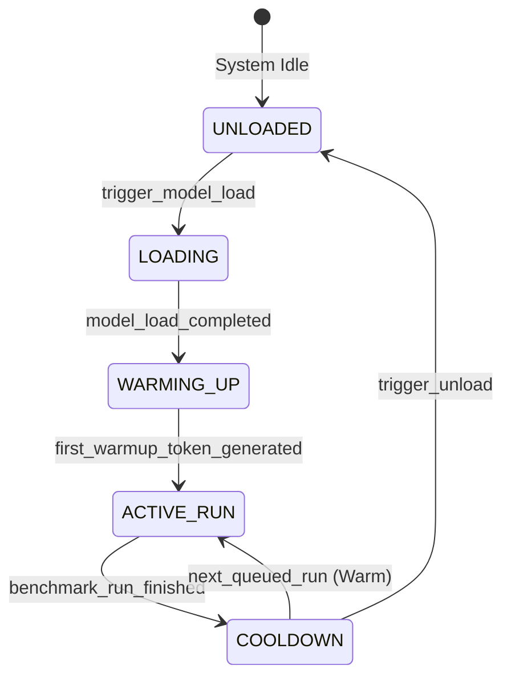

# CoVibe Enterprise AI Benchmark Standard (EABS-01)

**Document ID:** EABS-01  
**created_at:** 2026-05-27 05:00 AM (GMT+7)
**Version:** 2.1.0 (Restructure Revision)
**Last Update:** 2026-05-28 12:30 PM (GMT+7)
**Aliases:** EABS, Benchmark, LLM Benchmark Standard, AI Benchmark Protocal
**Status:** MANDATORY  
**Classification:** Internal Infrastructure Standard  
**Scope:** AI Model Benchmarking, Runtime Telemetry, Hardware Observability, Token Analytics, Resource Governance, and Regression Intelligence.

---

# 0. Core Philosophy

The benchmark platform MUST optimize for:

- reproducibility
- observability
- stability
- traceability
- thermal sustainability
- latency consistency
- energy efficiency
- long-term analytics


Peak TPS alone is NOT considered a valid enterprise benchmark metric.

The benchmark system **MUST** preserve:

- raw telemetry
- raw runtime logs
- raw prompts
- raw responses
- token traces
- event timelines
- runtime metadata

Aggregated summaries MUST NEVER replace raw source telemetry.

Raw telemetry is the source of truth.

---

# 1. Production Directory Structure

All benchmark executions MUST follow the structure below.

---

```
benchmark/
├── benchmark-kits/                                     # ส่วนจัดเก็บ Payload และคำถามทดสอบ
│   └── <kit_name>/                                     # ชื่อชุดทดสอบ เช่น TEST-000-CONCURRENCY
│        └── BENCHMARK--<test_name>.md                   * ข้อมูลสเปกการทดสอบและ Payload Mapping
├── benchmark-run/                                      # ส่วนจัดเก็บผลลัพธ์การรันจริง (Output Area)
|   └── <model-name>/                                   # แยกโฟลเดอร์หลักตามชื่อโมเดล เช่น qwen3-9b
|       └── <runid>/                                    # format "RUN-[YYMMDD]-[model_id]-[run_number]", e.g., RUN-260530-qw39b-001
|           ├── metadata.json                            * ข้อมูลควบคุมและสเปกสภาพแวดล้อมระบบ (Immutable)
|           ├── metrics.json                             * สรุปผลสถิติและประสิทธิภาพรวม (Aggregated Summary)
|           ├── samples.jsonl                            * ข้อมูล Telemetry ละเอียดระดับวินาที (Time-series Log)
|           ├── artifacts/                              # โฟลเดอร์เก็บรวบรวมไฟล์ประวัติทางระบบและข้อความดิบ
|           │   ├── prompt.txt                           * ไฟล์คำสั่ง/พรอพท์ที่ใช้ส่งทดสอบ
|           │   ├── response.txt                         * ผลลัพธ์คำตอบดิบจากตัวโมเดล
|           │   ├── purified_response.txt                * ผลลัพธ์คำตอบที่กรองแท็ก <think> ออกแล้ว (สำหรับ RL)
|           │   ├── logs.txt                             * ประวัติบันทึกสถานะการรันทั่วไป
|           │   ├── stderr.log                           * ข้อผิดพลาดเชิงระบบขณะรัน
|           │   ├── runtime_stdout.log                   * ข้อความมาตรฐานจากหน้าคอนโซลของ Engine
|           │   └── raw_hardware.hml                     * ล็อกระบบดิบจาก MSI Afterburner (กรณีรันบน Windows)
|           ├── documents/                              # โฟลเดอร์เก็บเอกสาร
|           │   ├── [runid]-PLAN-[PROJECT_NAME].md       * PRE-TEST(ระยะเตรียมการ):เอกสารแผนการทดสอบและสเปกขั้นต้น 
|           │   ├── [runid]-RUN-[PROJECT_NAME].md        * ACTIVE-TEST(ระยะรันการทดสอบ):บันทึกขั้นตอนหน้างานและผลการตรวจสอบสถิติแบบ Real-time 
|           │   ├── [runid]-REPORT-[PROJECT_NAME].md     * POST-TEST(ระยะสรุปผล):รายงานทางเทคนิคเชิงลึก(RCA)และประเมินความพร้อมสู่ระบบProduction
|           │   └── [runid]-SIGNOFF-[PROJECT_NAME].md    * POST-TEST(ระยะสรุปผล): Production Readiness & Sign-Off Sheet (PR-SO)
|           └── traces/                                 # ส่วนบันทึกเหตุการณ์และประวัติแบบละเอียดคู่ขนาน
|               ├── samples.jsonl                        * บันทึกข้อมูลเซนเซอร์รวมของรอบนั้นๆ
|               ├── system_logs.jsonl                    * ข้อมูลบันทึกสถานะฝั่งเซิร์ฟเวอร์
|               ├── events.jsonl                         * เส้นเวลาเหตุการณ์ (Event Timeline) เช่น first_token
|               ├── token_trace.jsonl                    * เวลาหน่วงที่เกิดขึ้นในการสร้างแต่ละโทเค็น (Per-token Latency)
|               └── failures.jsonl                       * บันทึกประวัติและจำแนกข้อผิดพลาด (Failure Taxonomy)
├── scripts/                                            # สคริปต์สำหรับช่วยในการรันและประมวลผล Benchmark
|   └── aggregate_benchmarks.py                          * สคริปต์ดึงรันเหล่านี้นำไปสรุปผลและแปลงข้อมูล
├── telemetry_logs/                                     # ไฟล์ดิบโดยตรงจาก HWiNFO / MSI / LibreHardware
├── templates/                                          # เทมเพลตสำหรับสร้างเอกสาร Benchmark
└── ui/                                                 # เทมเพลตสำหรับสร้าง UI Benchmark
```
---

# 2. Data Hierarchy Standard

## 2.1 metadata.json (Immutable Context)

Stores static benchmark environment metadata.

### Required Fields
```json
{
  "benchmark_id": "bench_20260527_001",
  "run_id": "run_a91ff2",
  "session_id": "sess_001",
  "experiment_id": "exp_q4km_ctx8k",
  "machine_id": "machine_rtx3060_01",
  "created_at": "2026-05-27T00:46:53.739Z",
  "model": {
    "name": "gemma4-rust-coder",
    "family": "Gemma",
    "license": "MIT",
    "base_model": "google/gemma-4-E4B-it",
    "variant": "Rust-Coder",
    "source": "huggingface",
    "model_url": "https://huggingface.co/MassivDash/Gemma-4-Rust-Coder",
    "format": "GGUF",
    "quantization": "Q4_K_M",
    "parameter_size": "9B",
    "context_length": 8192,
    "tags": ["gguf", "llama.cpp", "unsloth", "rust", "coding"],
    "ollama_manifest": {
      "schemaVersion": 2,
      "mediaType": "application/vnd.docker.distribution.manifest.v2+json",
      "config": {
        "mediaType": "application/vnd.container.image.v1+json",
        "digest": "sha256:4b4c3c807d092e41ccd2bcd9738b8a6478ecf6b4452ae67d42daca7c03f26439",
        "size": 453
      },
      "layers": [
        {
          "mediaType": "application/vnd.ollama.image.model",
          "digest": "sha256:559e43668ae5331cb8e6767e702eb71ba20834a5b88698ae71f216cc507bae21",
          "size": 3427873376,
          "from": "C:\\Users\\freshair\\.ollama\\models\\blobs\\sha256-559e43668ae5331cb8e6767e702eb71ba20834a5b88698ae71f216cc507bae21"
        },
        {
          "mediaType": "application/vnd.ollama.image.template",
          "digest": "sha256:31ea3e7b79889810fe53bd592aa395f43a0e37dc6c424bd1d8893d6f00f59b6d",
          "size": 96
        },
        {
          "mediaType": "application/vnd.ollama.image.params",
          "digest": "sha256:424fc810c3b53ae57cabd25d06b6111ade3db8bbc31e33b107d1ae929cbf6918",
          "size": 120
        }
      ]
    }
  },
  "dataset": {
    "name": "Fortytwo-Network/Strandset-Rust-v1",
    "dataset_url": "https://huggingface.co/datasets/Fortytwo-Network/Strandset-Rust-v1",
    "split": "test",
    "category": "rust-coding",
    "sample_id": "TASK-8K"
  },
  "runtime": {
    "runtime": "ollama",
    "runtime_version": "0.6.0",
    "backend": "llama.cpp",
    "backend_version": "b5123",
    "serving_mode": "single-user",
    "execution_mode": "local"
  },
  "environment": {
    "os": "Windows 10",
    "python_version": "3.12",
    "cuda_version": "12.8",
    "driver_version": "576.02",
    "timezone": "UTC+7 ICT(Bangkok)"
  }
}
```

---

## 2.2 metrics.json (Aggregated Summary)

Stores summarized benchmark metrics.

Used for:

- dashboards
- regression detection
- leaderboards
- comparisons
- ranking
- analytics

### Required Statistical Fields

Every measurable metric MUST support:

```json
{
  "benchmark_id": "bench_20260527_001",

  "status": "completed",

  "task_id": "task_001",
  "question_category": "coding",
  "context_length": 8192,
  "started_at": "2026-05-27T00:46:53.739Z",
  "ended_at": "2026-05-27T00:47:37.064Z",
  "duration_seconds": 43.32,

  "tokens": {
    "input": 20,
    "output": 20,
    "total": 40
  },

  "throughput": {
    "avg_tps": 103.06,
    "min_tps": 91.11,
    "max_tps": 114.22,
    "p95_tps": 112.88,
    "p99_tps": 114.01
  },

  "latency": {
    "ttft_ms": 245,
    "inter_token_latency_ms": {
      "avg": 8.2,
      "p95": 12.1,
      "p99": 14.8
    }
  },

  "gpu": {
    "max_temp_c": 67,
    "avg_temp_c": 59.1,

    "max_power_w": 412,
    "avg_power_w": 318,

    "max_vram_mb": 14320,
    "avg_vram_mb": 12780
  },

  "efficiency": {
    "tokens_per_watt": 0.82,
    "joules_per_token": 1.92
  },

  "quality": {
    "passed": true,
    "rank": "excellent",
    "score": 0.84321
  }
}
```

---


## 2.3 samples.jsonl (Raw Telemetry)

Stores append-only time-series telemetry.

### Format

One JSON object per line. Fields may vary based on source (HWiNFO or MSI Afterburner fallback).

```json
{"ts":"2026-05-27T00:46:53.739Z","gpu_temp":39.0,"gpu_power":22.0,"gpu_vram":9363.0,"cpu_usage":16.0}
{"ts":"2026-05-27T00:46:54.739Z","gpu_temp":41.0,"gpu_power":88.0,"gpu_vram":9380.0,"cpu_usage":23.5}
```

---

## 2.4 events.jsonl (Event Timeline)

Stores execution lifecycle events.

### Required Events

- benchmark_started
- model_loaded
- prefill_started
- first_token
- generation_started
- generation_finished
- benchmark_completed
- benchmark_failed
- thermal_throttle
- kv_cache_full
- runtime_warning
- runtime_crash

### Example

```json
{"ts":"2026-05-27T00:46:53.739Z","event":"benchmark_started"}
{"ts":"2026-05-27T00:46:57.233Z","event":"first_token"}
```

---

## 2.5 token_trace.jsonl (Per-Token Telemetry)

Stores token generation latency.

### Example

```json
{"token_index":1,"latency_ms":245}
{"token_index":2,"latency_ms":8}
```

---

## 2.6 failures.jsonl (Failure Taxonomy)

Stores structured failure reports.

### Example

```json
{
  "type": "thermal_throttle",
  "severity": "warning",
  "recoverable": true
}
```

---

# 3. Token Telemetry Standard

The orchestrator MUST expose token-level metrics. To maintain consistency with `metrics.json` and enterprise API standards, metrics MUST be serialized using the nested object schema below.

## Required Metrics Schema

```json
{
  "tokens": {
    "input": 1200,
    "output": 400,
    "total": 1600
  },
  "throughput": {
    "avg_tps": 125,
    "prompt_tps": 850
  },
  "latency": {
    "ttft_ms": 245
  }
}
```

---

# 4. Hardware Observability Standard

## GPU Metrics

Mandatory:

- temperature
- hotspot temperature
- power draw
- VRAM usage
- utilization
- fan speed
- memory clock
- core clock
- PCIe throughput

---

## CPU Metrics

Mandatory:

- utilization
- package temperature
- package power
- core clock

---

## RAM Metrics

Mandatory:

- RAM usage
- RAM temperature

---

## Storage Metrics

Mandatory:

- SSD temperature
- read throughput
- write throughput

---

# 5. KV Cache Observability

Required for all context benchmarks.

```json
{
  "kv_cache": {
    "allocated_mb": 8192,
    "used_mb": 7120,
    "utilization": 0.86
  }
}
```

---

# 6. Scheduler & Queue Telemetry

Required for concurrent runtimes.

```json
{
  "scheduler": {
    "queue_depth": 8,
    "active_requests": 4,
    "batch_size": 16
  }
}
```

---

# 7. Hardware Governance & Safety (Pre-flight Tuning & SOP)

## 7.1 RTX 3060 12GB Context Rules
- **Small Models (< 7B)**: Allowed up to 32K context.
- **Medium Models (8B – 13B)**: Allowed up to 32K with enforced power limits.
- **Large Models (>= 14B)**: STRICTLY LIMITED to 8K context locally without CPU offloading (to prevent TDR driver resets).

---

## 7.2 Pre-flight Hardware Tuning SOP
Before initiating any benchmark test, the host system MUST be configured using one of the following methods to manage clock rates, temperatures, and power ceilings:

### Method A: MSI Afterburner (GUI & Profile-based CLI activation)
1. **Core Clock Offset**: `-104MHz`
2. **Power Limit**: `90%`
3. **Execution Command (CLI)**: Save these settings to Profile slot 2 and apply them using:
   ```cmd
   "C:\Program Files (x86)\MSI Afterburner\MSIAfterburner.exe" -profile2
   ```

### Method B: NVIDIA-SMI Command Line (Direct CLI, Admin Rights required)
Run Command Prompt or PowerShell with administrator privileges and execute the following:
* **Set Power Limit (153W)**:
  ```cmd
  nvidia-smi -pl 153
  ```
  *(Note: 153W represents 90% of the default 170W power ceiling of the RTX 3060)*
* **Lock GPU Clocks (1500MHz)**:
  ```cmd
  nvidia-smi --lock-gpu-clocks=1500,1500
  ```
* **Reset GPU Clocks**:
  ```cmd
  nvidia-smi --reset-gpu-clocks
  ```

---

## 7.3 Thermal Safety Limits & Cooldown Policy
To protect the host hardware and maintain performance reliability, the orchestrator script and websocket monitor MUST enforce:
* **Safe Operating Zone**: `< 75°C`
* **Danger Zone**: `> 83°C` or sustained GPU power draw `> 165W`.
* **Thermal & Power Stop Rule**: If GPU temperature reaches `88°C` or above, or GPU power draw reaches `165W` or above, suspend execution immediately for `120 seconds`:
  ```python
  # Code logic for Thermal & Power Stop (NVIDIA Standard Adjusted)
  if gpu_temperature >= 88 or gpu_power_draw >= 165:
      logger.warning("GPU Temperature or Power limit exceeded. Triggering 120s cooldown...")
      time.sleep(120)
  ```
* **Cool-down Policy**: A mandatory `10 to 60-second` pause (`time.sleep()`) MUST be executed between local model swaps to dissipate residual heat.

---

# 8. Anti-Pattern Mitigation (Software Hardening SOP)

## 8.1 Infinite Reasoning Loop Guard
Reinforcement Learning models (e.g., Sushi-Coder RL) can get stuck in infinite generation loops. To safeguard memory and VRAM:
* **Max Output Limit**: API queries MUST specify `num_predict <= 2500` (recommended: `num_predict: 2500`).
* **Enforced Stop Sequences**:
  ```json
  [
    "<|im_end|>",
    "### END",
    "```\n\n",
    "Explanation:"
  ]
  ```
* **Inference Timeout**: The script calling the inference runtime must enforce a strict network/HTTP timeout of **300 seconds** to terminate hanging runs.

---

## 8.2 Think Syntax Purification (Reasoning Strip)
Raw output from RL-tuned models must be preserved in raw files, but purified outputs for accuracy scoring must strip out reasoning tokens using regex:
* **Mandatory Python Post-processing**:
  ```python
  import re
  purified_response = re.sub(r"<think>.*?</think>", "", raw_text, flags=re.DOTALL).strip()
  ```

---

# 9. Encoding Safety Standard (Emoji Crash Mitigation)

## 9.1 Forced UTF-8 Mode
High-plane Unicode characters and emojis generated by LLMs will crash default Windows terminals using the CP1252 codepage.
* **Python File Operations**: All read/write file streams MUST explicitly pass `encoding="utf-8"`.
* **Windows Terminal Detach Fix**: Python scripts MUST override and force UTF-8 on stdout and stderr:
  ```python
  import sys, codecs
  if sys.platform == "win32":
      sys.stdout = codecs.getwriter("utf-8")(sys.stdout.detach())
      sys.stderr = codecs.getwriter("utf-8")(sys.stderr.detach())
  ```

---

# 10. Runtime Classification Standard

Every benchmark MUST identify runtime architecture.

```json
{
  "runtime_class": {
    "runtime": "ollama",
    "backend": "llama.cpp",
    "serving_mode": "single-user",
    "execution_mode": "local"
  }
}
```

---

# 11. Sampling Governance Standard

## Mandatory Rules

```json
{
  "sampling_interval_ms": 1000,
  "clock_source": "monotonic",
  "timestamp_format": "ISO-8601 UTC"
}
```

---

## Recommended Sampling Intervals

| Workload | Interval |
|---|---|
| Inference | 500ms – 1s |
| Training | 100ms – 250ms |
| Debugging | 50ms |

---

# 12. Multi-GPU Futureproofing

All GPU schemas MUST support arrays.

```json
{
  "gpus": [
    {
      "gpu_id": 0,
      "name": "RTX 4090"
    }
  ]
}
```

---

# 13. Enterprise Observability Stack

| Layer | Primary Tool | Secondary |
|---|---|---|
| GPU Telemetry | NVIDIA DCGM | NVIDIA-SMI |
| System Metrics | Prometheus Node Exporter | LibreHardwareMonitor |
| Deep Monitoring | HWiNFO | LibreHardwareMonitor |
| Distributed Tracing | OpenTelemetry | Langfuse |
| Dashboard | Grafana | Plotly |
| Time-Series Database | ClickHouse | DuckDB |
| Local Benchmarking | MSI Afterburner | LibreHardwareMonitor |

---

# 14. Benchmarking Workflow

The CoVibe AI Infrastructure Benchmarking Workflow is structured into three main execution phases, aligning the operational tasks (Stages 1–6) with their corresponding documentation and verification steps (Documents 1–4).

```mermaid
graph TD
   subgraph Phase 1: PRE-TEST (Preparation)
      S1[Stage 1: Payload Generation] --> D1[Document 1: BD-TP Plan]
   end
   
   subgraph Phase 2: ACTIVE-TEST (Execution)
      D1 --> S2[Stage 2: Monitoring Activation]
      S2 --> S3[Stage 3: Runtime Execution]
      S3 --> D2[Document 2: ER-VFS Runbook]
   end

   subgraph Phase 3: POST-TEST (Analysis & Sign-Off)
      D2 --> S4[Stage 4: Telemetry Slicing]
      S4 --> S5[Stage 5: Aggregation]
      S5 --> S6[Stage 6: Analytics]
      S6 --> D3[Document 3: TBR-RCA Report]
      D3 --> D4[Document 4: PR-SO Sign-Off]
   end
```

---

## Phase 1: PRE-TEST (Preparation)

During this phase, workload inputs are prepared, and the benchmark design and plan are formalized.

### Step 1.1: Payload Generation (Stage 1)
Generate questions and test payloads.
- **Tool/Script:** `generate_payloads.py`
- **Output:** Payload files stored under [benchmark-kits/](file:///g:/covibe/benchmark/benchmark-kits/) directory.

```text
benchmark-kits/
└── <kit_name>/
    └── BENCHMARK--<test_name>.md  # Full Test Specification & Payload Mapping
```

### Step 1.2: Establish Design & Test Plan (Document 1)
Create the plan document under the run's workspace.
- **File Name:** `[runid]-PLAN-[PROJECT_NAME].md`
- **Location:** `benchmark-run/<model-name>/<runid>/documents/`

#### **DOCUMENT 1: PRE-TEST — AI Benchmark Design & Test Plan (BD-TP)**

**ID:** [runid]-PLAN-[PROJECT_NAME].md
```text
RUNID Format: RUN-[YYMMDD]-[model_id]-[run_number], e.g., RUN-260530-qw39b-001
```
**Version:** 1.0

**Status:** [Draft / Approved]

##### **1. Purpose & Scope (วัตถุประสงค์และขอบเขต)**

* **Objective:** [ระบุวัตถุประสงค์ เช่น เพื่อทดสอบประสิทธิภาพของโมเดล Qwen 3 (9B) ในการรองรับภาระงานประมวลผลโค้ดระดับสถาปัตยกรรม]  
* **Target Model:** [ระบุชื่อโมเดลและชนิด เช่น Qwen-3-9B-Instruct (GGUF Q4_K_M)]  
* **Success Criteria:** [ระบุเกณฑ์การทดสอบที่ถือว่าสอบผ่าน เช่น Decode TPS > 12 t/s, TTFT < 200 ms และไม่มี OOM Error ระหว่างรอบการรัน]

##### **2. Hardware & Environment Baselines (ข้อมูลระบบและสภาพแวดล้อมตั้งต้น)**

* **Host OS:** [เช่น Windows 11 Pro 23H2 / Linux Ubuntu 22.04 LTS]  
* **GPU:** [เช่น NVIDIA RTX 3060 12GB GDDR6]  
* **Driver & CUDA Version:** [เช่น NVIDIA Driver 596.49 / CUDA 12.4]  
* **Inference Engine:** [เช่น Ollama v0.24.0 / vLLM v0.4.2]  
* **Hardware Tuning Spec:**  
  * Core Clock Lock: [เช่น -104MHz]  
  * Power Limit: [เช่น 90% (153W)]  
  * Target Temperature Limit: [เช่น 80°C]

##### **3. Test Workload & Scenarios (สถานการณ์และภาระงานที่ใช้ทดสอบ)**

กำหนดระดับภาระงาน (Task Levels) เพื่อทดสอบขีดจำกัดของระบบ:
---
| Level | Task ID | Description / Use Case | Est. Input (Tokens) | Est. Output (Tokens) |
|---|---|---|---|---|
| **L1 (Base)** | [e.g., L1_BASE] | Simple logical reasoning or entity extraction | [เช่น 300] | [เช่น 512] |
| **L2 (Logic)** | [e.g., L2_LOGIC] | Algorithm design, priority queue operations | [เช่น 500] | [เช่น 1,000] |
| **L3 (Domain)** | [e.g., L3_DOMAIN] | Multi-file contextual analysis | [เช่น 1,500] | [เช่น 1,000] |
| **L4 (Stress)** | [e.g., L4_STRESS] | Giant code refactoring (8K+ tokens) | [เช่น 6,500] | [เช่น 2,000] |
| **L5 (Cycles)** | [e.g., L5_STRESS] | Rapid Load/Unload and model switching | N/A | N/A |

---

##### **4. Telemetry & Log Configuration (การบันทึกข้อมูลและเซนเซอร์)**

* **Telemetry Tools:** [เช่น NVML API, LibreHardwareMonitor (JSONL)]  
* **Sampling Interval:** [เช่น 1 วินาทีต่อ 1 Record โดยจะนำไป Decimate เหลือ 1/30 สำหรับ UI]  
* **Metric of Interest:**  
  * Primary: TTFT (ms), Prefill TPS, Decode TPS, VRAM Utilization (MB)  
  * Secondary: GPU Temp (°C), GPU Power Draw (W), Residual VRAM Post-Unload

---

## Phase 2: ACTIVE-TEST (Execution)

During this phase, physical telemetry monitoring is enabled, and workloads are run against the target model.

### Step 2.1: Activate System Monitoring (Stage 2)
Activate telemetry sensors and logging.
- **Tools/Drivers:**
  - HWiNFO CSV Logging (Primary) -> `telemetry_logs/`
  - MSI Afterburner logging (Fallback)
  - LibreHardwareMonitor collector

### Step 2.2: Execute Benchmark Workload (Stage 3)
Run the automated test runner in the specified execution mode.
- **Tool/Script:** `great_orchestrator.py`
- **Execution Modes:**
  - `local sequential` (Default)
  - `async cloud`
  - `distributed runtime`

### Step 2.3: Record Live Execution Runbook (Document 2)
Document active observations, warm-up latency, run status, and rapid load cycles.
- **File Name:** `[runid]-RUN-[PROJECT_NAME].md`
- **Location:** `benchmark-run/<model-name>/<runid>/documents/`

#### **DOCUMENT 2: ACTIVE-TEST — Benchmark Execution Runbook & Verification Sheet (ER-VFS)**

**ID:** [runid]-RUN-[PROJECT_NAME].md

**Executor:** [ชื่อผู้ทดสอบ/Agent]

**Run Timestamp Start:** [YYYY-MM-DD HH:MM:SS]

##### **1. Pre-Run Pre-flight Checks (ขั้นตอนตรวจสอบก่อนเริ่มรันจริง)**

* [ ] ตรวจสอบอุณหภูมิ GPU ตอน Idle (ไม่ควรเกิน 45°C)  
* [ ] บันทึกค่า Baseline VRAM ก่อนเปิด Service: [ค่าที่วัดได้] MB  
* [ ] ตรวจสอบการจำกัด Clock และ Power Limit ของ GPU ผ่าน command line หรือ MSI Afterburner  
* [ ] ทดสอบสคริปต์ Telemetry Logging: python scripts/check_telemetry_v2.py  
* [ ] ล้างหน่วยความจำและปิดโปรแกรมส่วนเกินเพื่อไม่ให้กวนผลการรัน

##### **2. Run Logs & Dynamic Telemetry Records (บันทึกระหว่างดำเนินการทดสอบ)**

###### **A. Warm-up Phase (ขั้นทดสอบรอบอุ่นเครื่อง)**

* Model Loaded: [โมเดลที่ใช้]  
* Warm-up Inference Status: [Success / Failed]  
* Warm-up Latency: [ค่าที่วัดได้] ms

###### **B. Actual Run Tracker (ตารางการรันจริง)**

*ผู้รันต้องกรอกข้อมูลจริงทันทีที่แต่ละรอบเสร็จสิ้น*

| Test ID | Loop | Run Status (Pass/OOM) | Observed Max Temp (°C) | Peek VRAM (MB) | Response Time (s) |
| :---- | :---- | :---- | :---- | :---- | :---- |
| L1_BASE | 1 | [ ] |  |  |  |
| L2_LOGIC | 1 | [ ] |  |  |  |
| L3_DOMAIN | 1 | [ ] |  |  |  |
| L4_STRESS | 1 | [ ] |  |  |  |

###### **C. L5 Rapid Cycle Test Log (กรณีทดสอบขีดจำกัดหน่วยความจำ)**

บันทึกสภาพ VRAM หลังทำกระบวนการโหลด/ถอนโมเดลอย่างรวดเร็ว (Rapid Load/Unload)

| Cycle | Loaded Model | Post-Load VRAM (MB) | Unloaded Model | Residual VRAM (MB) |
| :---- | :---- | :---- | :---- | :---- |
| 1 | [Model A] |  | [Model A] |  |
| 2 | [Model B] |  | [Model B] |  |
| 3 | [Model C] |  | [Model C] |  |
| 4 | [Model A] |  | [Model A] |  |
| 5 | [Model B] |  | [Model B] |  |

* **มีเหตุการณ์ OOM เกิดขึ้นหรือไม่:** [Yes / No] (ระบุรอบและจุดที่เกิดหากเกิดปัญหา)  
* **ความผิดปกติที่ตรวจพบหน้างาน:** [เช่น หลังจบรอบที่ 3 พบว่า Residual VRAM ไม่ยอมลดลงต่ำกว่า 7GB ส่งผลให้รอบที่ 4 มีความล่าช้าในการเริ่มต้นทำงาน]

---

## Phase 3: POST-TEST (Analysis & Sign-Off)

During this phase, raw logs are processed, metrics aggregated, and production readiness is decided.

### Step 3.1: Telemetry Slicing (Stage 4)
Process raw sensor logs into a unified format matching execution intervals.
- **Tool/Script:** `slice_hw_logs.py`
- **Inputs:**
  - HWiNFO `.csv` file: `...\covibe\benchmark\telemetry_logs\HWiNFO\<filename>.csv`
  - MSI Afterburner `.hml` file: `...\covibe\benchmark\telemetry_logs\MSI Afterburner\<filename>.hml`
  - LibreHardwareMonitor `.Report` file: `...\covibe\benchmark\telemetry_logs\LibreHardwareMonitor\LibreHardwareMonitor.Report`
- **Outputs:** Telemetry samples file `samples.jsonl` and raw logs stored under the run output directory. *(Note: Refer to [Section 1: Production Directory Structure](file:///g:/covibe/benchmark/CoVibe-ENTERPRISE-BENCHMARK-STANDARD.md#1-production-directory-structure) for the exact output directory and file tree path).*

### Step 3.2: Aggregate Metrics (Stage 5)
Generate execution summary.
- **Tool/Script:** `aggregate_benchmarks.py`
- **Output:** Summary file `metrics.json` containing latency and memory KPIs.

### Step 3.3: Publish Analytics (Stage 6)
Push metrics into target enterprise analytics stacks.
- **Targets:**
  - DuckDB
  - ClickHouse
  - Grafana

### Step 3.4: Technical Report & Root Cause Analysis (Document 3)
Create technical report and analyze any anomalies (e.g. VRAM fragmentation).
- **File Name:** `[runid]-REPORT-[PROJECT_NAME].md`
- **Location:** `benchmark-run/<model-name>/<runid>/documents/`

#### **DOCUMENT 3: POST-TEST — Technical Benchmark Report & RCA (TBR-RCA)**

**ID:** [runid]-REPORT-[PROJECT_NAME].md

**Author:** [ชื่อผู้เขียนรายงาน/Senior Architect Agent]

##### **1. Executive Summary**

[สรุปสาระสำคัญของผลการทดสอบเชิงบริหาร เช่น โมเดลผ่านการทดสอบหรือไม่ พบปัญหาคอขวดตรงจุดใด และผลกระทบต่อระบบโดยรวม]

##### **2. System Architecture & Methodology**

[อธิบายสถาปัตยกรรมข้อมูล วิธีการคำนวณ Decimation ของสถิติ telemetry และเงื่อนไขการทดสอบ]

##### **3. Complete Empirical Results (ผลการทดสอบอย่างละเอียด)**

[ตารางเปรียบเทียบผลลัพธ์ประสิทธิภาพจริง รวมถึง Token Distribution จากการวิเคราะห์ Log ย้อนหลัง]

##### **4. Root Cause Analysis (RCA) - สำหรับเคสที่ระบบล้มเหลวหรือหน่วงผิดปกติ**

* **Problem Statement:** [เช่น เกิด OOM เมื่อทำการสลับใช้งานโมเดลสลับกันไปมาในระดับ L5]  
* **5 Whys Analysis:**  
  1. ทำไมระบบถึงขึ้น OOM? -> *เพราะ VRAM บน GPU ไม่เพียงพอในการโหลดโมเดลตัวถัดไป*  
  2. ทำไม VRAM ถึงไม่พอในเมื่อโมเดลก่อนหน้าสั่ง Unload ไปแล้ว? -> *เพราะยังมีหน่วยความจำตกค้าง (Residual VRAM) สูงถึง 7.6GB*  
  3. ทำไมถึงมีหน่วยความจำตกค้างสูงขนาดนั้น? -> *เพราะ Windows Display Driver Model (WDDM) และ Ollama Service ไม่สั่งคืนหน่วยความจำ (Compact) ในทันที*  
  4. [เติมคำตอบถัดไปตามบริบทระบบ]  
* **Proven Mitigation Plan:** [ระบุแผนการแก้ไขปัญหาในระบบจริง เช่น การเพิ่มคำสั่ง force_restart_ollama() หรือการกำหนด VRAM Context Padding ป้องกันไว้ 1GB]

### Step 3.5: Production Readiness Sign-Off (Document 4)
Evaluate against KPIs and formalize deployment approval.
- **File Name:** `[runid]-SIGNOFF-[PROJECT_NAME].md`
- **Location:** `benchmark-run/<model-name>/<runid>/documents/`

#### **DOCUMENT 4: POST-TEST — Production Readiness & Sign-Off Sheet (PR-SO)**

**ID:** [runid]-SIGNOFF-[PROJECT_NAME]

**Review Board:** [รายชื่อวิศวกรผู้ประเมินและสถาปนิกโครงสร้างระบบ]

##### **1. Performance Checklist against KPIs (ตารางตรวจสอบเทียบกับเกณฑ์มาตรฐาน)**

| Standard Metrics (EABS-01) | Target Threshold (เกณฑ์ขั้นต่ำ) | Actual Score (ผลสอบเฉลี่ย) | Evaluation (ผ่าน/ไม่ผ่าน) |
| :---- | :---- | :---- | :---- |
| **First Token Latency (TTFT)** | < 250 ms | [ใส่ค่าจริง] | [ ] Pass - [ ] Fail |
| **Generation Rate (Decode)** | > 12.0 tokens/sec | [ใส่ค่าจริง] | [ ] Pass - [ ] Fail |
| **VRAM Margin Room** | > 1,024 MB (During L4) | [ใส่ค่าจริง] | [ ] Pass - [ ] Fail |
| **Error Rate (OOM/Crash)** | 0.00% (Over 20 cycles) | [ใส่ค่าจริง] | [ ] Pass - [ ] Fail |

##### **2. Risk Assessment & Safe-Guards (การวิเคราะห์ความเสี่ยงและการป้องกัน)**

* **Risk Detected:** [เช่น ความไม่แน่นอนของ Windows WDDM ในการคืน VRAM (Fragmentation)]  
* **Production Safeguard Implementation:**  
  * [ ] ได้ทำการฝังฟังก์ชัน Garbage Collection อัตโนมัติใน Orchestrator หรือยัง?  
  * [ ] มีการสร้าง Watchdog Service สำหรับคอย Monitor และรีสตาร์ต Inference Engine เมื่อเจอสัญญาณ VRAM รั่วไหลหรือยัง?  
  * [ ] ระบบหน้าบ้าน (Dashboard) แสดงผลค่าทางกายภาพจริงของ GPU ได้ถูกต้องและลื่นไหลดีแล้วใช่หรือไม่?

##### **3. Deployment Approval (คำรับรองความพร้อมและอนุญาตให้นำไปใช้งาน)**

จากการประเมินเชิงเทคนิคและเอกสารสรุปผลการทดสอบตามข้อกำหนด **EABS-01** คณะทำงานมีความเห็นชอบร่วมกันดังนี้:

* [ ] **APPROVED (อนุมัติ):** ระบบมีความพร้อมในการผลักดันขึ้นสู่ระบบ Production เพื่อทำงานจริงร่วมกับ CoVibe Agent Framework  
* [ ] **CONDITIONAL APPROVED (อนุมัติแบบมีเงื่อนไข):** นำไปใช้ได้ แต่ต้องมีการจำกัด Task L4 และห้ามใช้โมเดลสลับกันไปมาหากไม่มีการสั่ง Force Clear Cache ทุกๆ 2 ชั่วโมง  
* [ ] **REJECTED (ปฏิเสธ):** ต้องส่งโมเดลหรือระบบกลับไปปรับแต่งฮาร์ดแวร์/ซอฟต์แวร์ใหม่ เนื่องจากไม่ผ่านเกณฑ์สำคัญด้าน [ระบุหัวข้อที่ไม่ผ่าน]

**ลงชื่อผู้อนุมัติโครงการ:** ___________________________

(ชื่อ-นามสกุล)

ตำแหน่ง: Senior AI Infrastructure Engineer / Lead Solution Architect

วันที่: YYYY-MM-DD

---

# 15. Enterprise Benchmarking Architecture

```text
Inference Runtime
    ↓
Telemetry Collector
    ↓
OpenTelemetry / Prometheus
    ↓
Time-Series Database
    ↓
Aggregation Pipeline
    ↓
Analytics API
    ↓
Grafana / Dashboard
```

---

# 16. Real-Time Telemetry & Execution Protocol (RTTEP)

The platform supports live-interactive benchmarking triggered from the dashboard and streamed in real-time.

## 16.1 WebSocket Streaming Channel
- **Protocol:** WebSockets (WS/WSS)
- **Port:** Enforced default `8787` (binds to localhost for security).
- **Update Frequency:** Hardware metrics MUST be collected and emitted at `1000ms` intervals.

## 16.2 Standard Event Schema
- `start_benchmark_run`: Triggered from UI with configurations (`provider`, `model_id`, `prompt`).
- `abort_benchmark_run`: Halts spawned child processes instantly via SIGKILL.
- `benchmark_status`: Notifies state changes (`running`, `completed`, `failed`, `idle`).
- `benchmark_log`: Streams live process stdout/stderr logs.
- `live_hardware_sample`: Pushes per-second system metrics directly to dashboard variables for live rendering.

## 16.3 Thermal & Power Safety Guard Integration
- In addition to standard OS throttles, the telemetry server MUST parse real-time HML readings.
- If a sample shows `GPU_Temp >= 88°C` or `GPU_Power >= 165W`, the server MUST emit a critical warning log, suspend the active run, and enforce a 120-second cooling period.

## 16.4 Post-Run Cooldown Monitoring
- Telemetry streams MUST continue to emit metrics for at least `10 seconds` after the runner process exits.
- This captures the thermal cooldown slope of the GPU/CPU for analysis.

## 16.5 Real-Time Execution Call Graph

The following call graph visualizes the event-driven interactions between components during a real-time benchmark run under the RTTEP protocol:



---

# 17. Statistical Validity & Variance Governance (EABS-01-SV)

To eliminate operating system scheduling noise, background driver interrupts, and thermal fluctuations, a single-run execution is NOT sufficient for production sign-off.

## 17.1 Multi-Run Execution Requirements

Baseline Tasks (L1-L3): MUST be executed for a minimum of $N = 3$ continuous runs.

Stress Tasks (L4-L5): MUST be executed for a minimum of $N = 5$ continuous runs.

Warm-up Exemption: The very first run (Run 0) of any sequence may be excluded from statistical calculations to account for cache allocation overhead, provided it is marked as warmup: true in the events log.

## 17.2 Mathematical Definitions for Variance Metrics

The system aggregator MUST calculate and append the following statistical metrics to metrics.json:

Arithmetic Mean ($\mu$):

$$\mu = \frac{1}{N} \sum_{i=1}^{N} x_i$$

Standard Deviation ($\sigma$):


$$\sigma = \sqrt{\frac{1}{N} \sum_{i=1}^{N} (x_i - \mu)^2}$$

Coefficient of Variation (CV):


$$CV = \frac{\sigma}{\mu}$$


An EABS-01 compliant run MUST achieve a $CV \le 0.05$ (5%) for Decode TPS to be considered highly stable.

---

## 17.3 Updated metrics.json Statistical Schema Extension

This object block MUST be nested inside the primary metrics.json file under the "quality" field:

---

```json
{
  "statistical_validity": {
    "runs_evaluated": 5,
    "warmup_run_excluded": true,
    "tps_variance_metrics": {
      "mean_decode_tps": 14.52,
      "standard_deviation": 0.38,
      "coefficient_of_variation": 0.0261
    },
    "latency_variance_metrics": {
      "mean_ttft_ms": 168.8,
      "ttft_std_dev_ms": 4.25,
      "ttft_p95_ms": 172.1
    }
  }
}
```
# 18. Cold-Start Latency Isolation & Lifecycle State Machine

To prevent initialization costs (such as disk-to-RAM I/O, RAM-to-VRAM loading, and CUDA context initialization) from skewing the Time-to-First-Token (TTFT) metrics, the orchestrator MUST enforce a strict model lifecycle state machine.



## 18.1 State Defintions & Logging Rules

LOADING state: Begins when the engine process is spawned or the API call is made. Ends when the system registers the model weight allocations on VRAM.

Required Event Logs: model_load_triggered and model_load_completed MUST be recorded in events.jsonl with microsecond-level timestamps.

WARMING_UP state: Executes a dummy inference payload (10-20 tokens). This primes the KV cache and activates CUDA kernels.

Required Event Logs: warmup_triggered and warmup_completed MUST be recorded.

ACTIVE_RUN state: This is the only state where token-level telemetry (token_trace.jsonl) is recorded for performance evaluation.

# 19. Performance Regression Intelligence & CI/CD Gateways

To prevent software updates, driver revisions, or model parameter merges from degrading system efficiency, EABS-01 defines strict automated CI/CD gating rules.

## 19.1 Regression Thresholds (The 5/10 Rule)

A code or runtime modification is classified as a Performance Regression if the automated runner detects either of the following conditions when compared against the production baseline:

Decode TPS Degradation: A decrease of $> 5\%$ in average generation speed ($\mu_{\text{new}} < 0.95 \times \mu_{\text{baseline}}$).

TTFT Increase: An increase of $> 10\%$ in average time-to-first-token ($\mu_{\text{new\_ttft}} > 1.10 \times \mu_{\text{baseline\_ttft}}$).

## 19.2 Orchestrator Exit Codes

When running within a continuous integration runner (e.g., GitHub Actions, GitLab CI), the orchestrator script (great_orchestrator.py) MUST return the following system exit codes to halt dirty deployment pipelines:

|Exit Code|Classification|Trigger Condition|
|---|---|---|
|0|SUCCESS|Benchmark run complete, all tasks passed, performance within baseline bounds.|
|101|REGRESSION_DETECTED|Benchmark complete but violates the EABS 5/10 regression rule.|
|102|HARDWARE_GOVERNANCE_FAULT|Execution aborted due to thermal limits ( $> 88^\circ\text{C}$ ) or power limit violations ( $> 165\text{W}$ ).|
|103|STABILITY_FAIL|Run aborted due to OOM errors, runtime crash, or infinite loops.|

## 19.3 Failure Schema Extension (failures.jsonl)

In the event of a regression-induced exit, a structured record MUST be appended to failures.jsonl:

```jsonl 
{
  "ts": "2026-05-30T08:15:22.105Z",
  "type": "performance_regression",
  "severity": "critical",
  "recoverable": false,
  "details": {
    "metric": "decode_tps",
    "baseline_val": 14.52,
    "observed_val": 13.11,
    "deviation_percent": -9.71,
    "allowed_threshold_percent": -5.00
  }
}
```
---
**END OF DOCUMENT**

