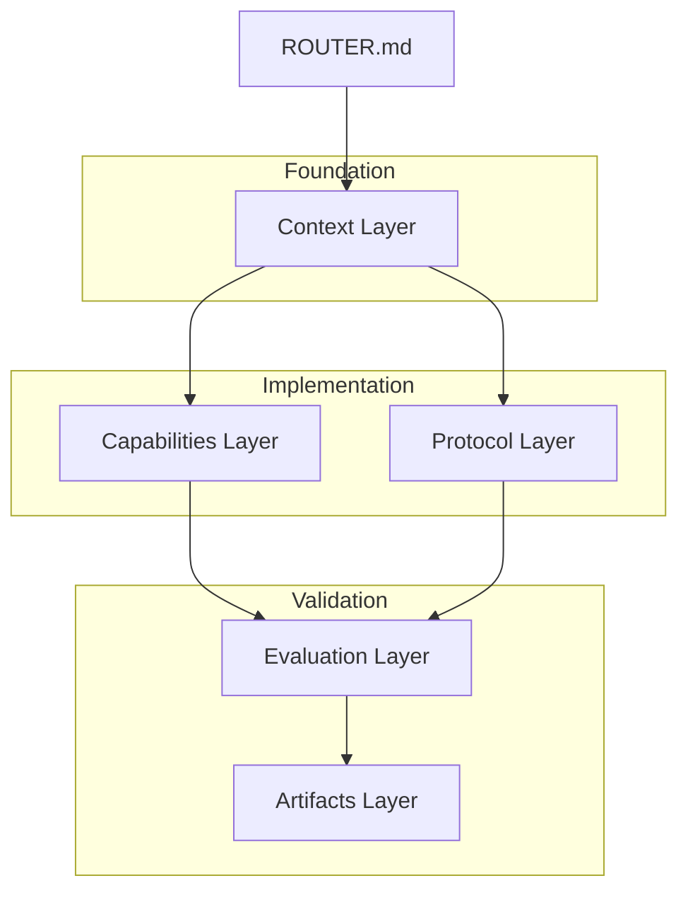

# CoVibe Enterprise Architecture Candidate (EAC-01)

**Status:** PROPOSED / CANDIDATE  
**Version:** 1.0  
**Target Standard:** Agent-to-Agent (A2A) Semantic Discovery  

## 1. Core Philosophy
The CoVibe architecture is designed for **Hybrid Intelligence**, where human developers and AI agents collaborate seamlessly. Documentation must be machine-discoverable, human-readable, and strictly typed in intent.

---

## 2. Proposed Agentic Directory Structure

### 🗺️ Context Layer (`/docs/context/`)
*Primary purpose: Knowledge injection for new developers and AI agents.*
- `system_prompt.md`: The "Source of Truth" for agent behavior and project personality.
- `architectural_decisions.md` (ADR): Historical log of "Why" technical choices were made.
- `domain_vocabulary.md`: Glossary of project-specific terminology (e.g., "Telemetry Slicing", "Purified Response").
- `logic_constraints_pwa.md`: Technical limitations and guardrails for the PWA runtime.

### 🛠️ Capabilities Layer (`/docs/capabilities/`)
*Primary purpose: Functional inventory and integration specs.*
- `api_specifications.md`: Detailed Interface definitions for internal and external services.
- `feature_manifests.md`: A live inventory of implemented and planned features.
- `integration_protocols.md`: How the AI Backend (Ollama) communicates with the Web Frontend.

### 📜 Protocol Layer (`/docs/protocols/`)
*Primary purpose: Operational governance and multi-agent interaction.*
- `multi_agent_protocol.md`: Rules for handoffs and data sharing between multiple AI agents.
- `error_taxonomy.md`: Standardized error codes and recovery procedures for AI failures.
- `security_model.md`: Access control and data privacy standards.

### 🧪 Evaluation Layer (`/docs/evaluation/`)
*Primary purpose: Quality assurance and benchmark governance.*
- `benchmark_standards.md` (EABS-01): The established standard for AI model testing.
- `test_scenarios.md`: Pre-defined edge cases for system validation.
- `regression_intelligence.md`: Rules for detecting performance degradation.

### ⚖️ Governance Layer (`/docs/architecture/`)
*Primary purpose: Strategic oversight.*
- `scope_priority_framework.md`: Rules for prioritizing engineering tasks.
- `deployment_strategy.md`: CI/CD and production environment specifications.

---

## 3. Machine Discovery Protocol (MDP)
Every documentation root MUST contain a `ROUTER.md` that maps intents to file paths:

```markdown
# Documentation Router
- "I need to understand the project" -> /docs/context/
- "I want to add a new feature" -> /docs/capabilities/
- "How do I fix an error?" -> /docs/protocols/error_taxonomy.md
```

---

## 4. Documentation Lifecycle
1. **Drafting:** New ideas start in `/prototypes/`.
2. **Standardization:** Validated ideas move to `/capabilities/` or `/architecture/`.
3. **Archiving:** Deprecated docs move to `/archive/` with a tombstone entry in `ROUTER.md`.

---

## 5. Implementation Status (Mapped Structure)
This represents how the existing documentation in `G:\covibe\docs` maps to the proposed A2A structure.

```text
G:\covibe\docs\
├── context\
│   ├── logic_constraints_pwa.md
│   └── scope_priority_framework.md
├── capabilities\
│   ├── feature_analytics_events.md
│   ├── feature_buffer_handling.md
│   ├── feature_host_handoff.md
│   ├── feature_passenger_search.md
│   ├── feature_queue_management.md
│   └── feature_trip_summary.md
├── protocols\
│   └── (To be populated with API and Protocol specs)
├── evaluation\
│   ├── benchmark_report.md
│   ├── compatibility_report.md
│   └── sushirl_unit_tests.md
├── artifacts\
│   ├── incident_report_sushirl.md
│   ├── job_report_sushirl.md
│   └── INC--CSP-EVAL-BLOCKED.md
├── prototypes\
│   └── prototype_youtube_sync.md
└── designs\
    ├── AmberCitrus-Design.html
    ├── covibe_ai_benchmark_dashboard.tsx
    └── covibe_ai_benchmark_fulldashboard.html
```

---

## 6. Documentation DAG (Directed Acyclic Graph)
This graph represents the logical flow and dependencies of the documentation system. Agents should follow this path for full system assimilation.



---

## 7. Code-Documentation Interoperability
To ensure the code remains consistent with the architecture, physical Junction Links are established within the documentation root.

- `/docs/src_link/` -> Maps to core React application logic.
- `/docs/server_link/` -> Maps to WebSocket and Telemetry server.
- `/docs/scripts_link/` -> Maps to benchmarking and monitoring scripts.

AI Agents are encouraged to use these links to verify implementation against the described standards in the Capabilities Layer.

---
**END OF CANDIDATE DOCUMENT**
