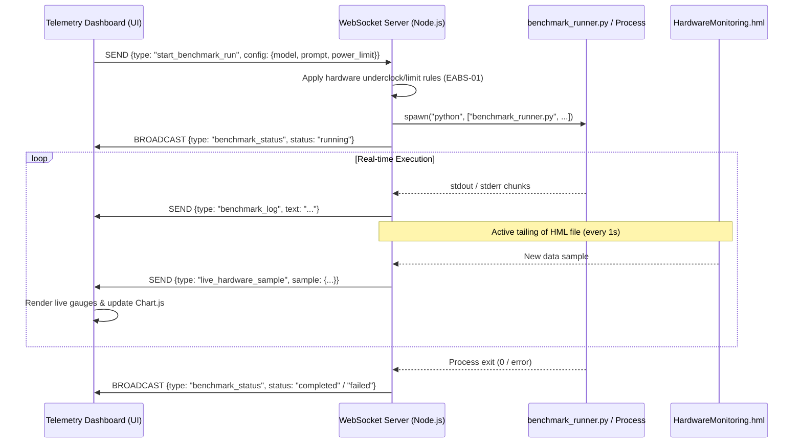

# Feature Specification: Real-time Benchmark Execution & Telemetry Streaming Control

## 1. Overview & Objective
This specification defines the functional requirements, system architecture, and integration protocols for introducing **Real-time Benchmark Control** and **WebSocket-based Telemetry Streaming** into the CoVibe Benchmark Platform.

This feature enables developers to:
1. Trigger AI benchmark execution runs (e.g. executing LLM runners) directly from the Glassmorphism Telemetry Dashboard UI.
2. Monitor terminal execution logs (stdout/stderr) streamed from the backend process in real-time.
3. Observe live hardware metrics (GPU/CPU thermals, power, VRAM utilization) as they are measured, mapped directly onto gauges, charts, and the core reactor animation.

---

## 2. Architecture & Data Flow
The real-time monitoring and control loop consists of:
1. **Frontend (Browser UI):** Exposes inputs to configure the run, triggers WebSocket events, displays streamed terminal logs, and appends real-time hardware telemetry samples to the active dataset.
2. **Orchestrator Backend (Node.js WebSocket Server):** Processes the run request, spawns the runner process (e.g. Python scripts), tails the active telemetry log, and broadcasts stderr/stdout/telemetry events back to the client.
3. **Hardware Logger (MSI Afterburner / LibreHardwareMonitor):** Continuously writes live hardware stats to `D:\hw_log\HardwareMonitoring.hml`.



---

## 3. Communication Protocols & Message Schema

### 3.1 Client -> Server: Start Benchmark Run
Initiates the benchmark runner process on the host machine.
```json
{
  "type": "start_benchmark_run",
  "config": {
    "provider": "gemini", 
    "model_id": "gemini-2.0-flash",
    "prompt": "Write a fast concurrent queue in Rust with Mutex.",
    "power_limit_percent": 90,
    "core_offset_mhz": -104
  }
}
```

### 3.2 Client -> Server: Terminate Benchmark Run
Aborts the current running benchmark process immediately.
```json
{
  "type": "abort_benchmark_run"
}
```

### 3.3 Server -> Client: Benchmark Status
Broadcasts execution status transitions.
```json
{
  "type": "benchmark_status",
  "status": "running" | "completed" | "failed" | "idle",
  "error": "Optional error string if failed"
}
```

### 3.4 Server -> Client: Real-time Terminal Log
Streams stdout and stderr bytes from the spawned process.
```json
{
  "type": "benchmark_log",
  "text": "[Ollama] generating tokens... [TPS: 103.06]\n"
}
```

### 3.5 Server -> Client: Live Hardware Sample
Sends mapped and cleaned hardware statistics parsed in real-time from the telemetry file tail.
```json
{
  "type": "live_hardware_sample",
  "sample": {
    "Timestamp": "10:34:02",
    "GPU_Temp": 42.0,
    "GPU_Usage": 85.1,
    "VRAM_Used": 4500,
    "GPU_Power": 125.40,
    "GPU_Fan": 52,
    "CPU_Temp": 54,
    "CPU_Usage": 48,
    "RAM_Used": 15270,
    "Core_Clock": 1850,
    "Memory_Clock": 7500,
    "CPU_Clock": 4395,
    "CPU_Power": 45.60
  }
}
```

---

## 4. UI/UX Changes in Telemetry Dashboard
We will modify `glassmorphism_hardware_telemetry_dashboard.html` to integrate the following panels:

1. **Benchmark Controller Widget:**
   * Dropdown selector for **Model/Provider** (e.g. Qwen local, Gemini cloud, etc.).
   * Input text area for the testing **Prompt**.
   * Button **"รันการทดสอบระบบ (Run Benchmark)"** to start, and **"ยกเลิกด่วน (Emergency Abort)"** to terminate.
2. **Terminal Console Monitor:**
   * A terminal emulator log viewer (styled with terminal green text, dark background, and auto-scroll) displaying the execution outputs.
3. **Live Telemetry Injection:**
   * Connect WebSocket callbacks.
   * On receiving `live_hardware_sample`, append to the dashboard's internal `parsedData` dataset.
   * Call `updateDashboardWidgets()` with the index of the newly added sample to animate the reactor, gauges, and update the Chart.js timelines in real-time.

---

## 5. Security & Safety Governance
1. **RTX 3060 Thermal Stop Guard (EABS-01 compliance):**
   * If a `live_hardware_sample` reports a `GPU_Temp >= 71`, the server or client triggers a 120-second cooling pause, sending a warning packet and updating the UI status bar to "THERMAL SUSPEND ACTIVE".
2. **Local Bind Restriction:**
   * The execution trigger MUST only be active when accessed via `localhost` or safe internal origins. The backend will enforce access checking on spawned tasks.
