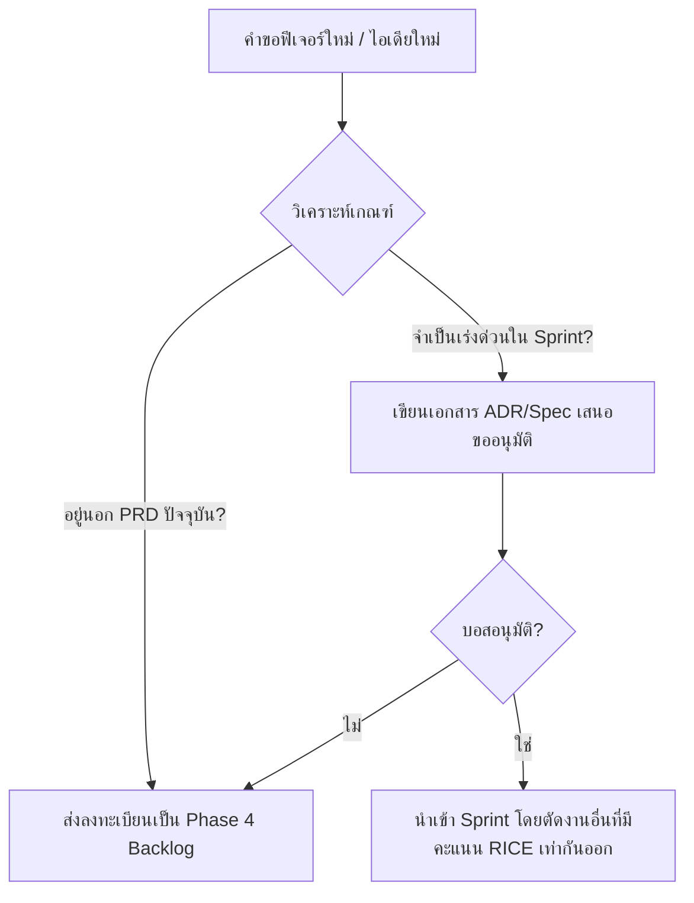

# CoVibe Scope & Priority Management Framework

เอกสารนี้ทำหน้าที่เป็นคู่มือและเครื่องมือสำหรับทีมและผู้ถือหุ้น (Stakeholders) เพื่อใช้ควบคุมขอบเขตของโครงการ (Scope) และการจัดลำดับความสำคัญ (Priority) ของแอปพลิเคชัน CoVibe เพื่อป้องกันปัญหาขอบเขตงานขยายตัวอย่างไร้การควบคุม (Scope Creep)

---

## 1. เกณฑ์การลำดับความสำคัญด้วย MoSCoW Method

ระบบ MoSCoW จะแบ่งฟีเจอร์ออกเป็น 4 กลุ่มหลักตามผลกระทบต่อวิสัยทัศน์ผลิตภัณฑ์ (North Star):

*   **Must Have (ต้องมี):** ฟีเจอร์ที่หากขาดไป แอปพลิเคชันจะไม่สามารถตอบโจทย์การแชร์เพลงระดับพื้นฐานได้ หรือส่งผลให้ผู้ใช้ใช้งานได้อย่างไม่ปลอดภัยขณะขับขี่
*   **Should Have (ควรมี):** ฟีเจอร์สำคัญที่ช่วยให้ผู้ใช้ได้รับประสบการณ์ที่ดีขึ้นอย่างมาก แต่ถ้าไม่มี แอปยังคงเปิดใช้งานได้โดยไม่ล่ม
*   **Could Have (น่าจะมี):** ฟีเจอร์เสริมที่เพิ่มความพึงพอใจในการใช้งาน (Nice-to-have) หากมีทรัพยากรและเวลาเหลือ
*   **Won't Have (ยังไม่มีในเฟสนี้):** ฟีเจอร์ที่มีข้อตกลงร่วมกันอย่างชัดเจนว่าจะไม่พัฒนาในเฟสปัจจุบัน (MVP) เพื่อรักษาเวลาส่งมอบงาน

---

## 2. ระบบการให้คะแนนลำดับความสำคัญแบบมีเหตุผลด้วย RICE Scoring

เพื่อไม่ให้ใช้ความรู้สึกส่วนตัวในการเลือกงาน เราจะใช้สูตรคำนวณสากล **RICE Score**:

$$\text{RICE Score} = \frac{\text{Reach} \times \text{Impact} \times \text{Confidence}}{\text{Effort}}$$

### คำนิยามตัวแปร (Scoring Matrix)

1.  **Reach (การเข้าถึงผู้ใช้ใน 1 ทริป):**
    *   `100` = ส่งผลต่อทั้ง Rider และ Passenger ทุกครั้งที่ฟังเพลงร่วมกัน
    *   `80` = ส่งผลต่อผู้ใช้เฉพาะเวลาเกิดเหตุการณ์เฉพาะ (เช่น สัญญาณเน็ตอ่อน)
    *   `50` = ส่งผลเฉพาะตอนจบทริป หรือเฉพาะตอนกดตั้งค่า
    *   `20` = ส่งผลเฉพาะกลุ่ม Edge Case ขนาดเล็ก (เช่น คนเปิดห้องกดปิดแอปกระทันหัน)
2.  **Impact (ผลกระทบต่อเป้าหมายหลัก):**
    *   `3` = Massive (ส่งผลมหาศาลต่อการแชร์ประสบการณ์ฟังเพลงซิงค์กัน)
    *   `2` = High (เพิ่มความสะดวกหรือความเสถียรในการทำงานอย่างชัดเจน)
    *   `1` = Medium (อำนวยความสะดวกทั่วไป แต่ไม่ได้เพิ่มความเสถียรของเพลง)
    *   `0.5` = Low (ส่งผลในส่วนที่ผู้ใช้ไม่ได้รับรู้โดยตรง เช่น ระบบ Telemetry/Analytics)
3.  **Confidence (ความมั่นใจด้านข้อมูลและเทคนิค):**
    *   `1.0` (100%) = มั่นใจสูง มี API รองรับชัดเจน และได้ทำการทดสอบโครงร่างไว้แล้ว
    *   `0.8` (80%) = มั่นใจปานกลาง อาจมีประเด็นเรื่องข้อจำกัดเบราว์เซอร์บน iOS/Android บางยี่ห้อ
    *   `0.5` (50%) = มั่นใจต่ำ เป็นเทคโนโลยีใหม่ที่อาจต้องทำ Spike หรือวิจัยเชิงลึกก่อนเขียนโค้ด
4.  **Effort (แรงงานและเวลาในการพัฒนา - กำหนดเป็น Person-Days):**
    *   `1` = จบได้ใน 1 วันทำการ
    *   `3` = จบได้ในครึ่งสัปดาห์
    *   `5` = ต้องใช้เวลาทำเต็มๆ 1 สัปดาห์ (5 วันทำการ)
    *   `10` = ต้องใช้เวลา 2 สัปดาห์เต็ม
    *   `20+` = งานขนาดใหญ่ที่มีความซับซ้อนสูงมาก

---

## 3. ตารางประเมิน RICE Scoring สำหรับ Backlog คงเหลือ (Sprint 2A & 2B)

| รหัสงาน | ชื่อฟีเจอร์ / รายละเอียดงาน | Reach | Impact | Confidence | Effort (Days) | RICE Score | การจัดกลุ่ม MoSCoW |
| :--- | :--- | :---: | :---: | :---: | :---: | :---: | :---: |
| **`p2-s2b-3`** | **Passenger Remote:** ค้นหา YouTube + เพิ่มเพลงเข้าคิว | 100 | 3 | 0.9 (90%) | 5 | **54.0** | ⭐ **Must Have** |
| **`p2-s2a-4`** | **Buffer State Handling:** แจ้งเตือนเมื่อเน็ตช้า & ซิงค์เพลงกลับมาอัตโนมัติ | 80 | 2 | 1.0 (100%) | 3 | **53.3** | ⭐ **Must Have** |
| **`p2-s2b-4`** | **Trip Summary:** หน้าสรุปรายการทริปดนตรีหลังจบการเดินทาง | 50 | 1 | 1.0 (100%) | 2 | **25.0** | 📈 **Should Have** |
| **`p2-s2b-5`** | **Analytics Events:** บันทึก Metric การดริฟต์และการใช้ปุ่มเพื่อการปรับปรุงระบบ | 100 | 0.5 | 1.0 (100%) | 2 | **25.0** | 📈 **Should Have** |
| **`p2-s2a-5`** | **Host Handoff Fallback:** โอนสิทธิ์ผู้ควบคุมให้คนซ้อนเมื่อคนขับตัดการเชื่อมต่อ | 20 | 2 | 0.8 (80%) | 4 | **8.0** | 💡 **Could Have** |
| **`p4-task-1`** | **Hotspot/Local Mode:** รันวง LAN ท้องถิ่นเพื่อแชร์เพลงโดยไม่ใช้เน็ต | 90 | 3 | 0.5 (50%) | 15 | **9.0** | 💤 **Won't Have (MVP)** |
| **`p4-task-2`** | **Intercom Voice Chat:** ระบบคุยสาย VoIP ในตัวแอปผ่าน WebRTC | 70 | 2 | 0.5 (50%) | 20 | **3.5** | 💤 **Won't Have (MVP)** |

*วิเคราะห์ผลลัพธ์:*
*   **Must Have** จะถูกโฟกัสทำเป็นอันดับแรกสุดเนื่องจากคะแนน RICE เกิน 50 (คุ้มค่าสูง ทำงานได้เร็ว)
*   **Host Handoff** แม้จะมีประโยชน์สูง แต่เนื่องจาก Reach ต่ำมาก (เกิดขึ้นไม่บ่อย) และความมั่นใจด้านการจัดการ WebSocket ต่ำกว่าตัวอื่น จึงถูกจัดอยู่ในระดับ **Could Have**
*   **Hotspot Mode & Intercom** คะแนน RICE ต่ำมากเนื่องจาก Effort มหาศาลและความมั่นใจต่ำมากจากข้อจำกัด Sandbox ของ Web Browser จึงควรเก็บไว้หลังปล่อยตัวจริง (Won't Have สำหรับเวอร์ชันเว็บ MVP)

---

## 4. มาตรการและกลไกป้องกันการเกิด Scope Creep (ขอบเขตงานบวม)

เพื่อควบคุมให้โครงการสามารถส่งมอบตรงตามกำหนดเวลา ภายใต้มาตรฐานการพัฒนาวิศวกรรมซอฟต์แวร์ เราจะใช้มาตรการ 4 ข้อดังต่อไปนี้อย่างเคร่งครัด:

### 1) การใช้กฎ Documentation-Driven (No Spec, No Code)
*   **กฎ:** ห้ามเพิ่มปุ่ม ฟังก์ชัน หรือตัวแปรใดๆ เข้าไปในระบบโดยที่ไม่มีการอัปเดตสเปกในโฟลเดอร์ `docs/` ก่อน
*   **วิธีปฏิบัติ:** หากมีความต้องการฟีเจอร์ใหม่เกิดขึ้นกลางคัน ผู้พัฒนาต้องสร้างร่างเอกสารอธิบายการทำงาน (Spec) และส่งเสนออนุมัติก่อนเสมอ เพื่อให้เห็นขนาดงานที่เพิ่มขึ้นจริง

### 2) การตั้งกฎ Swap-Out (แลกเปลี่ยนของเท่ากัน)
*   **กฎ:** ปริมาณ Effort ของแต่ละ Sprint จะถูกจำกัดไว้คงที่ (Timeboxed)
*   **วิธีปฏิบัติ:** หากมีความจำเป็นต้องยัดฟีเจอร์เร่งด่วนเข้ามาใน Sprint ปัจจุบัน จะต้องเลือกตัดงานเก่าที่มีคะแนน RICE ต่ำกว่าหรือมี Effort ใกล้เคียงกันออกจาก Sprint นั้นทันที (ห้ามสะสมงานเพิ่มเกินขีดความสามารถของคนพัฒนา)

### 3) การแยกถังเก็บไอเดียระดับอนาคต (Won't Have Bin)
*   **กฎ:** ไอเดียแปลกใหม่ทั้งหมดที่ไม่ได้อยู่ในข้อตกลง PRD ฉบับตั้งต้น จะถูกบังคับเขียนลงใน "Phase 4 - Backlog" ในไฟล์ `CoVibe-ROADMAP.md` ทันที
*   **วิธีปฏิบัติ:** จะไม่มีการเขียนโค้ดพรีวิวหรือโค้ดทดลองทิ้งไว้ในสาขาหลัก (Main Branch) เพื่อไม่ให้ขยะสเปซขยายตัวและกระทบความเสถียรของแอป

### 4) การตรวจวัด Scope Completeness ด้วย Definition of Done (DoD)
*   **กฎ:** งานแต่ละชิ้นจะนับว่าเสร็จ (Done) ก็ต่อเมื่อผ่านการทดสอบตาม Test Cases ที่กำหนดไว้ในสเปกเท่านั้น
*   **วิธีปฏิบัติ:** ป้องกันผู้พัฒนาแอบเพิ่มความสามารถภายนอกเหนือความคาดหมาย (Gold Plating) โดยการทดสอบเฉพาะผลลัพธ์ที่ระบุในเอกสารสเปกอย่างตรงไปตรงมา
