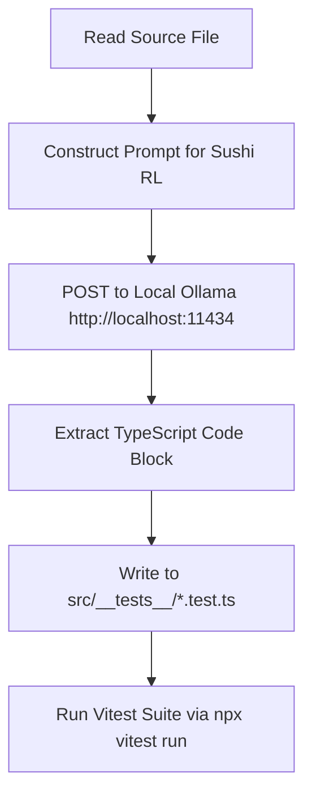

# Functional Specification: Automated Unit Test Generation via Local Sushi RL (9B)

**Status: ⏳ PROPOSED**

## 1. Overview
The goal is to leverage the local Ollama instance running the **Sushi RL (9B)** model (`sushirl:latest`) to generate robust unit tests for the remaining untested utility modules in CoVibe:
- `src/utils/time.ts` (Time formatting helper)
- `src/utils/participant.ts` (Participant ID generator)
- `src/utils/analytics.ts` (Client analytics tracking)
- `src/utils/youtube-api.ts` (YouTube IFrame API loader)

We will automate this process using a Python script that reads the source files, sends them to local Ollama, parses the generated Vitest code, saves the tests, and executes them.

---

## 2. Architecture & Workflow

The automated pipeline operates in three stages:



### 2.1 Test Generation Script (`scripts/generate_tests.py`)
A Python script that:
1. Lists target utility files.
2. Formulates prompts asking `sushirl` for Vitest tests.
3. Handles POST request to `http://localhost:11434/api/generate` with low temperature (0.1) for deterministic output.
4. Extracts code from the returned markdown fence blocks (````typescript ... ````).
5. Writes the generated test files into `src/__tests__/`.

### 2.2 Test Environment & Configurations
- Target framework: **Vitest** (installed in `devDependencies`).
- Test files suffix: `.test.ts`.
- Mocks & Environment:
  - For browser APIs (`window`, `document`, `navigator`, `localStorage`, `crypto`), tests will use the `/** @vitest-environment jsdom */` annotation or stub them globally using Vitest's `vi.stubGlobal()` or spy utilities.

---

## 3. Test Specifications & Expected Scenarios

Here are the functional scenarios the generated unit tests should cover for each module:

### 3.1 `time.ts` -> `src/__tests__/time.test.ts`
- **Function:** `formatTime(ms: number)`
- **Test cases:**
  - Standard formatting: e.g., `125000` ms -> `"2:05"`.
  - Under 1 minute: e.g., `45000` ms -> `"0:45"`.
  - Zero/negative inputs: e.g., `0` or `-1000` -> `"0:00"`.
  - Edge case: large duration (e.g., hours in ms) -> correct minute conversion.

### 3.2 `participant.ts` -> `src/__tests__/participant.test.ts`
- **Function:** `makeParticipantId()`
- **Environment:** Requires JSDOM for `localStorage` and `crypto`.
- **Test cases:**
  - When `localStorage` has no existing participant ID:
    - Generates a new ID using `crypto.randomUUID()`.
    - Saves the ID to `localStorage`.
    - Returns the new ID.
  - When `localStorage` already has an existing ID:
    - Returns the existing ID.
    - Does not generate a new ID or overwrite the existing one.

### 3.3 `analytics.ts` -> `src/__tests__/analytics.test.ts`
- **Function:** `trackEvent(send, event, metadata)`
- **Test cases:**
  - Successfully calls the `send` function with type `"analytics_event"`.
  - Verifies payload structure including clientTimestamp and userAgent (from `navigator.userAgent`).
  - Error handling: if the `send` function throws an error, the function catches it silently and doesn't crash the application.

### 3.4 `youtube-api.ts` -> `src/__tests__/youtube-api.test.ts`
- **Function:** `loadYouTubeApi()`
- **Environment:** Requires JSDOM for DOM Manipulation.
- **Test cases:**
  - If `window.YT.Player` is already loaded, it should resolve immediately.
  - If not loaded, it should check for an existing YouTube iframe API script tag.
  - If script tag does not exist: creates a script element with source `"https://www.youtube.com/iframe_api"`, appends it to `document.body`, and resolves when `window.onYouTubeIframeAPIReady` is triggered.
  - If script tag already exists: does not create a new one, but still resolves when `window.onYouTubeIframeAPIReady` is called.

---

## 4. Proposed Files to Add
- `docs/sushirl_unit_tests.md`: This documentation.
- `scripts/generate_tests.py`: Python script to invoke Ollama and write the test files.
- `src/__tests__/time.test.ts`: Generated unit test file.
- `src/__tests__/participant.test.ts`: Generated unit test file.
- `src/__tests__/analytics.test.ts`: Generated unit test file.
- `src/__tests__/youtube-api.test.ts`: Generated unit test file.
