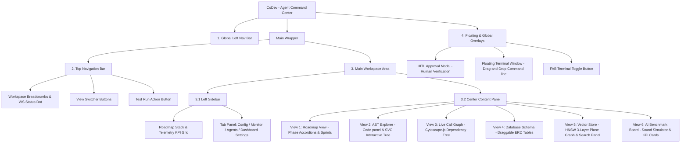

# Site Map of Untitled-1.html (CoDev - Agent Command Center)

**File Path:** [G:\covibe\Untitled-1.html](file:///G:/covibe/Untitled-1.html)
**Purpose:** Multi-view developer command center dashboard interface for CoVibe development.

---

## 1. Visual Navigation Map (Mermaid Diagram)



---

## 2. Hierarchical Tree Structure (โครงสร้างแบบแผนภูมิต้นไม้)

โครงสร้างการจัดวางคอมโพเนนต์และลำดับชั้นหน้าจอควบคุม (DOM Hierarchy Layout):

```text
CoDev - Agent Command Center (Untitled-1.html)
├── 1. Global Left Navigation Bar (แถบเมนูด้านซ้ายสุด)
│   ├── App Logo (โลโก้หลัก)
│   ├── AST Viewer Button (ปุ่มทางลัดสลับมุมมอง AST)
│   ├── Roadmaps Button (ปุ่มทางลัดสลับมุมมองบอร์ด)
│   ├── Agent Hub Button (ปุ่มทางลัดสลับมุมมองเอเจนต์)
│   ├── Knowledge Base Button (ปุ่มทางลัดสลับมุมมองฐานข้อมูล)
│   ├── Settings Button (ปุ่มตั้งค่าด่วน)
│   └── User Avatar (ภาพโปรไฟล์ผู้ใช้งาน)
├── 2. Top Navigation Bar (แถบเมนูด้านบนสุด)
│   ├── Breadcrumbs (ระบุพิกัด CoDev Workspace > CoVibe)
│   ├── WebSocket Connection Status Dot (ไฟบอกสถานะพอร์ต 8787)
│   ├── View Switcher Buttons (แถบเปลี่ยนมุมมองหลัก 6 รูปแบบ)
│   │   ├── Roadmap View Button
│   │   ├── AST Explorer View Button
│   │   ├── Call Graph View Button
│   │   ├── Database View Button
│   │   ├── Vector Store View Button
│   │   └── Benchmark View Button
│   └── Top Actions (ปุ่มเรียกคำสั่งจำลอง Test Run)
├── 3. Main Workspace Area (พื้นที่หน้าจอหลัก)
│   ├── 3.1 Left Sidebar (แผงควบคุมฝั่งซ้าย - แสดงใน Roadmap & Benchmark)
│   │   ├── Roadmap Stack (แถบเปอร์เซ็นต์ความคืบหน้าโครงการและ Telemetry KPIs)
│   │   └── Tab Panel Sub-menus (ระบบแท็บตั้งค่า/ประมวลผลย่อย)
│   │       ├── Config Tab (ตั้งค่า Prompt และ Path)
│   │       ├── Monitor Tab (แสดงประวัติการเรียกทำงาน Execution Trace)
│   │       ├── Agents Tab (ตรวจสอบสถานะ Agent Roster)
│   │       └── Settings Tab (เปลี่ยนธีม Midnight/OLED/Cyberpunk/Forest, ลิมิตความร้อน, ปริมาณเสียง)
│   └── 3.2 Center Content Pane (แผงกลางแสดงมุมมองตามที่เลือก)
│       ├── Roadmap View (พื้นที่แสดงการ์ด Phase 0-4 และ Sprint งานย่อย)
│       ├── AST Explorer View (มุมมองแยก: Code Panel และ AST Tree Canvas ที่ลากย้ายได้)
│       ├── Call Graph View (มุมมองแสดงผัง Dependency Cytoscape.js และกล่องข้อมูลข้างขวา)
│       ├── Database View (มุมมองแยก: แท็บฟังก์ชันฐานข้อมูล และ ERD Canvas แสดงตารางสัมพันธ์)
│       ├── Vector Store View (มุมมองแยก: ตัวป้อนคำสืบค้น, กราฟ HNSW 3 ชั้น, และผลการคำนวณ)
│       └── AI Benchmark View (มุมมองแยก: ชุดปุ่มโมเดล, เครื่องเล่น Waveform sandbox, และชาร์ตวิเคราะห์ความร้อน)
└── 4. Overlays & Floating Components (ส่วนแสดงผลทับซ้อนและหน้าต่างลอย)
    ├── HITL Verification Modal (กล่องอนุมัติ Human-In-The-Loop สำหรับยืนยันไวยากรณ์)
    ├── FAB Terminal Button (ปุ่มลอยสำหรับเปิด/ปิด Terminal)
    └── Floating Terminal Window (หน้าต่างเชลล์คำสั่งที่เคลื่อนย้ายได้ พร้อมแถบสลับโหมดคำสั่ง)
```

---

## 3. Interface Navigation & Layout Breakdown

### 2.1 Global Left Navigation Bar (`nav`)
- **App Logo:** Codesandbox Brand Icon (`ti-brand-codesandbox`)
- **Quick Links:**
  - **AST Viewer:** Icon (`ti-hierarchy-2`)
  - **Roadmaps:** Icon (`ti-layout-kanban`)
  - **Agent Hub:** Icon (`ti-users`)
  - **Knowledge Base:** Icon (`ti-database`)
- **Settings & User Profile:** Settings cog button (`ti-settings`) and avatar placeholder.

### 2.2 Top Navigation Bar (`header`)
- **Breadcrumbs:** `CoDev Workspace > CoVibe`
- **Connection Status:** WebSocket server status indicator dot (Default port: `8787`).
- **Main View Switcher:** Buttons to switch active views in the center panel:
  - **Roadmap:** `roadmap` view
  - **AST:** `canvas` view
  - **Call Graph:** `callgraph` view
  - **Database:** `database` view
  - **Vector Store (HNSW):** `vector` view
  - **Benchmark:** `benchmark` view
- **Actions:** **Test Run** button (`ti-player-play`) which starts the AST Traversal animation.

### 2.3 Left Sidebar (`aside#left-sidebar`)
*Only active when the Roadmap or Benchmark views are selected.*
- **Roadmap Progress & Metrics:**
  - Global project progress percentage, stats count (Total, Done, Pending, Phase).
  - Telemetry KPIs: Spend ($), Calls, Tools, Forecast ($), Input/Output Tokens, time, and GPU temperature.
- **Tab Panel Sub-menus:**
  - **Config (`tab-settings`):** System prompt setting and workspace path.
  - **Monitor (`tab-monitor`):** Execution trace list.
  - **Agents (`tab-agents`):** Agent roster status (EVA-cli, Qwen Coder, Local Dev).
  - **Settings (`tab-dashboard-settings`):** UI Theme selection, Autoplay Assist toggle, Telemetry interval poll frequency, GPU thermal safety caution limit, and synthesizer volume control.

### 2.4 Center Content Pane (`main > section`)

#### 1) Roadmap View (`#roadmap-view`)
Organizes CoVibe features into phase-based accordions:
- **Phase 0: Technical Spike:** YouTube API integration, WebSocket room proof of concept.
- **Phase 1: MVP Core:** React/Vite project setup, WebSocket backend room state, QR code generation, room join flow.
- **Phase 2: Sync Calibration:** Playback speed adjustments, background playback handling, OLED Saver.
- **Phase 3: Beta Test & Real Rider Feedback:** WebRTC voice channel spike, telemetry logs, feedback forms.
- **Phase 4: Post-Beta Expansion:** Hotspot direct connection, intercom voice chat, convoy GPS, voice commands.
- **Sprint / Tasks structure:** Task items support status verification checkboxes (`Doc`, `Code`, `Test`), assignee selection (`Assist`), and status badges (`Waiting`, `Done`).

#### 2) AST Explorer (`#workflow-canvas`)
- **AST Code Viewer:** Left pane displaying code snippet `calculateDrift.js` with code line highlighters.
- **AST Canvas:** Right pane containing tree nodes (`Program`, `FunctionDeclaration`, `BinaryExpression`, `CallExpression`) connected via dynamic SVG curves.

#### 3) Live Call Graph View (`#callgraph-view`)
- **Toolbar:** Database connection metadata, depth level selector (All, 1, 2, 3+), "Sync Tree-sitter" action button.
- **Cytoscape Graph Area:** Interactive tree view displaying dependencies grouped into parent packages (`apps/web`, `packages/msp`, `packages/gks`).
- **Floating Details Panel:** Node file details, inbound/outbound call lists.

#### 4) Database Schema View (`#database-view`)
- **Management Sidebar:** Database sections (Tables, Functions, Triggers, Replication, Backups).
- **Interactive ERD Canvas:** Drag-and-drop table layouts (`transactions`, `orders`, `conversations`, `tasks`, `employees`) with SVG path connectors.

#### 5) Vector Store View (`#vector-view`)
- **Control Panel:** Input query field, new document ingestion form, rebuild index graph actions, similarity parameters.
- **HNSW Visualizer:** Visual 3-plane HNSW graph structure (Layer 2 Skip lane, Layer 1 Sub-express, Layer 0 Base KNN) displaying node greedy traversal paths.
- **Search Results:** Scoring matched items by Cosine Similarity rankings.

#### 6) AI Benchmark Dashboard (`#benchmark-view`)
- **KPI Metrics:** Task in Focus, Champion Speed, GPU clock safety, Token Efficiency, Failed Runs.
- **Sound Simulator Sandbox:** Web Audio API synth generator producing sine waveforms rendered dynamically on an HTML5 canvas oscilloscope.
- **Overview & Performance:** Detailed champion lists comparing tokens/sec output across different LLM backends (Qwen, Ollama, Gemini).

### 3.5 Overlays & Dialogs
- **Human-In-The-Loop Modal (`#hitl-modal`):** Halt/Verify prompt overlay to authorize AST execution paths.
- **Floating Terminal Window (`#floating-terminal`):** WebSocket terminal shell trace supporting multiple environments (Gemini, System, EVA, Qwen). Activated/toggled by the floating terminal button (`#fab-terminal`).

---

## 4. Top-Nav to Side-Nav State Dependency (ความสัมพันธ์การทำงานของเมนูด้านบนและเมนูด้านข้าง)

ระบบใช้ความสัมพันธ์เชิงตรรกะแบบ **Parent-Child Router** โดยผู้ใช้เลือก Domain หลัก (Parent) บน Top Navigation Bar แล้วแถบเมนูด้านข้าง (Left Sidebar) จะอัปเดตแสดงเฉพาะปุ่มฟังก์ชันย่อย (Child Sub-modules) ของ Domain นั้นโดยอัตโนมัติ เพื่อรักษาความเป็นสัดส่วนและประหยัดพื้นที่หน้าจอ:

### ตารางความเกี่ยวข้องการแสดงผลระดับโดเมน (Domain State Mapping Table)

| Top Nav Domain (Parent) | Left Sidebar Sub-modules (Child) | Action & View triggered |
| :--- | :--- | :--- |
| **Domain A: Project Overview** | A1: Dashboard <br> A2: Roadmap Board <br> A4: Agent Hub | `#benchmark-view` <br> `#roadmap-view` <br> กางบอร์ด/แผงประมวลผลเอเจนต์ด้านข้าง |
| **Domain B: Genesis Knowledge System** | B1: AST Explorer <br> B3: Call Graph | `#workflow-canvas` <br> `#callgraph-view` |
| **Domain C: Genesis Block DB** | C1: Database ERD Schema <br> C2: Vector Store (HNSW) | `#database-view` <br> `#vector-view` |

### รายละเอียดการทำงานของการแสดงผลแบบ Dynamic Sidebar

1. **การคลิกปุ่ม Domain บน Top Nav (Parent Selection):**
   - เมื่อคลิกเลือก Domain A, B, หรือ C: แถบ Sidebar ทางซ้ายจะถูกกรองและเปลี่ยนไอคอน + ข้อความเมนูเป็นชุด Sub-modules ของโดเมนนั้นทันที
   - แถบเมนูด้านข้าง (Left Sidebar) จะถูกบังคับให้กางออกหรือปรับความกว้างให้เหมาะสม
2. **การสับเปลี่ยนหน้าทำกิจกรรมหลัก (Content Syncing):**
   - การคลิก Sub-modules ในเมนูด้านข้างจะเป็นตัวสั่งคำสั่งเปลี่ยนหน้า Canvas หรือแสดงผล Panel ตามวัตถุประสงค์ย่อยจริง (เช่น การคลิก A2: Roadmap Board จะสับเปลี่ยนหน้าหลักไปที่ `#roadmap-view` เป็นต้น)


---

## 5. Detailed View Features Specification (คำอธิบายรายละเอียดฟีเจอร์แต่ละหน้าหลัก)

แดชบอร์ด **CoDev - Agent Command Center** ประกอบด้วย 6 หน้าต่างย่อย (Main Views) ที่ถูกออกแบบมาเพื่อวัตถุประสงค์เฉพาะทางด้านการตรวจสอบระบบและการประเมินประสิทธิภาพ โดยมีรายละเอียดการทำงานดังนี้:

### 5.1 Roadmap View (หน้าต่างแผนการพัฒนาโครงการ)
หน้านี้ทำหน้าที่เป็นแดชบอร์ดหลักในการติดตามโครงการและสั่งงานเอเจนต์ AI ในการเขียนโค้ด
- **Interactive Phase Accordion**: ระบบกล่องเปิด-ปิดดูขอบข่ายงานของแต่ละเฟส (Phase 0 - 4) พร้อมแอนิเมชันเลื่อนหน้าจออัตโนมัติ (Smooth scroll) เมื่อขยายเฟสถัดไป
- **Sprints & Task Checkboxes**: ตารางรายงานผลสถานะภารกิจย่อยในแต่ละ Sprint ที่แยกการตรวจสอบสถานะออกเป็น 3 ขั้นตอน: `Doc` (การทำเอกสาร), `Code` (การเขียนโปรแกรม), และ `Test` (การเขียนการทดสอบ)
- **AI Assist Selectors**: เมนูเลือกมอบหมายภารกิจให้กับเอเจนต์ AI เฉพาะด้าน เช่น EVA Agent, Qwen Coder หรือจำลองการทำสอบด้วย Local Dev node
- **Active WebSocket Execution**: การคลิกที่รายการงานที่ค้างอยู่จะทำการยิงคำสั่งในรูปแบบ JSON Payload ผ่าน WebSocket Server เพื่อเรียกเอเจนต์หลังบ้านให้รันและส่ง Log กลับมาแสดงจริง
- **Phase Exit Criteria Checklists**: ตารางตรวจสอบเงื่อนไขความสำเร็จก่อนสิ้นสุดแต่ละเฟส เพื่อรับประกันคุณภาพก่อนการย้ายงานเข้าสู่โปรดักชัน

### 5.2 AST Explorer View (หน้าต่างวิเคราะห์โครงสร้างต้นไม้ไวยากรณ์)
เครื่องมือตรวจสอบและแสดงความสัมพันธ์ของตัวแปรและบล็อกสโคปของโค้ดแบบเรียลไทม์
- **Linked Code & Editor Panel**: แผงฝั่งซ้ายแสดงบรรทัดของโค้ดโปรแกรมภาษา JavaScript (`calculateDrift.js`) พร้อมติดตั้งตัวระบุตำแหน่งแถบสี (Line Highlighter)
- **Draggable AST Tree Canvas**: แผงแสดงโครงสร้างต้นไม้แบบมีปฏิสัมพันธ์ (Interactive Canvas) ประกอบด้วยกล่องประเภท Node (เช่น Program, FunctionDeclaration, BinaryExpression) ที่ผู้ใช้สามารถคลิกลากและย้ายพิกัดได้ตามสะดวก
- **Laser Traversal Animation**: เมื่อกดปุ่ม **Test Run** จะเป็นการรันสคริปต์จำลองการเข้าถึงไวยากรณ์ (AST Traversal Simulation) โดยจะวาดเส้นเลเซอร์เลื่อนไหลวิ่งผ่านจุดพอร์ตของแต่ละ Node

### 5.3 Live Call Graph View (หน้าต่างความสัมพันธ์ฟังก์ชัน)
แดชบอร์ดที่ช่วยให้นักพัฒนามองเห็นภาพโครงสร้างแพ็กเกจย่อยและลำดับการเรียกใช้งานของโปรแกรมทั้งหมด
- **Interactive Network Layout**: การใช้ไลบรารี Cytoscape.js เพื่อวาดผังเครือข่ายความสัมพันธ์ของฟังก์ชันต่างๆ ที่แบ่งสัดส่วนตามกลุ่มแพ็กเกจย่อยของ Monorepo (`apps/web`, `packages/msp`, `packages/gks`)
- **Hover & Dim Dependency Highlight**: เมื่อนำเมาส์ไปชี้ที่ Node ระบบจะทำการหรี่ไฟ (Dim) ตัวแปรหรือเส้นเชื่อมโยงที่ไม่ได้เกี่ยวข้องกัน และจะไฮไลต์เน้นเฉพาะคู่ฟังก์ชันที่เป็น Inbound และ Outbound ของฟังก์ชันนั้น
- **Depth Selector Control**: ตัวเลือกจำกัดความลึกของแผนภาพ เพื่อกรองข้อมูลในการทำความเข้าใจการเชื่อมโยง เช่น แสดงเฉพาะการเรียกตรง (Level 1) หรือดูความเชื่อมโยงทั้งหมด (Full Path)
- **SQLite & Tree-sitter Synchronizer**: ปุ่มวิเคราะห์ผังความสัมพันธ์ใหม่ด้วย Tree-sitter Parser เพื่ออัปเดตข้อมูลพิกัดความเชื่อมโยงล่าสุดของระบบ

### 5.4 Database Schema View (หน้าต่างสถาปัตยกรรมฐานข้อมูล)
บอร์ดแสดงความสัมพันธ์และโครงสร้างตารางข้อมูลในรูปแบบ Entity-Relationship Diagram (ERD)
- **Interactive ERD Canvas**: แผงวาดความสัมพันธ์ความเชื่อมโยงของฐานข้อมูล โดยวาดเส้นเชื่อมจากคู่ตารางต่างๆ ด้วยเส้นเบซิเยร์ (Bezier curves) ที่อัปเดตมุมโค้งตามการเคลื่อนไหวของการ์ดตาราง
- **Draggable Table Cards**: แผงหน้าต่างตารางที่แสดงรายการคอลัมน์ คีย์หลัก (PK) คีย์นอก (FK) และชนิดตัวแปรของแต่ละฟิลด์ (`transaction_id`, `order_id`, etc.)
- **Auto Layout Engine**: ปุ่มคำนวณตำแหน่งการวางการ์ดตารางตามสัดส่วนที่กางและเหมาะสมบนหน้าจอโดยอัตโนมัติ เพื่อไม่ให้การ์ดทับซ้อนกัน

### 5.5 Vector Store View (หน้าต่างจำลองระบบสืบค้นความรู้ HNSW)
หน้าแสดงพฤติกรรมการค้นหาและการจัดเรียงดัชนีของฐานข้อมูลเวกเตอร์ (Vector Database) ที่ AI ใช้ในการจำข้อมูล
- **HNSW 3-Layer Plane Graph**: แบบจำลองเลเยอร์กราฟ HNSW 3 มิติ แบ่งย่อยเป็น Layer 2 (Express Skip Lane), Layer 1 (Sub-Express Lane), และ Layer 0 (Base Nearest Neighbors)
- **Path Traversal Simulator**: แอนิเมชันแสดง Greedy Search Traversal โดยระบบจะจำลองทิศทางการกระโดดสืบค้นข้อมูลเวกเตอร์แบบเรียลไทม์ โดยเล็งจุดจาก Anchor ชั้นบนสุดและข้ามลงมาหาเพื่อนบ้านที่ใกล้ที่สุดในชั้นล่าง
- **Ingest Memory Pipeline**: แบบฟอร์มป้อนประมวลผลข้อความความจำใหม่เพื่อแปลงเป็น Embedding และอัปเดตเข้าร่วมในแผนผังพิกัดเวกเตอร์บนเลเยอร์กราฟทันที
- **Rank Metric List**: ตารางแสดงผลความคล้ายคลึงของประโยคที่สอดคล้องกับคำค้นหา โดยแปลงค่าความเหมือนเป็นเปอร์เซ็นต์ (Cosine Similarity %) พร้อมแถบสีแจ้งระดับความแม่นยำ

### 5.6 AI Benchmark Dashboard (หน้าต่างวิเคราะห์และจำลองการปรับแต่ง AI)
หน้ารายงานผลลัพธ์การวัดระดับ AI โมเดลบนอุปกรณ์ RTX 3060 ตามมาตรฐาน EABS-01
- **Oscilloscope Visual Sandbox**: กล่องจำลองเครื่องกำเนิดสัญญาณคลื่นเสียง (Sine Wave Synth Engine) ด้วย Web Audio API ผู้ใช้สามารถเลือกเปรียบเทียบโมเดล และทดสอบฟังความเสถียรของคลื่นผ่านออสซิลโลสโคปบนจอ Canvas
- **Hardware Telemetry Monitor**: ตัวแสดงระดับการใช้งาน VRAM ความจุสูงสุด อุณหภูมิการ์ดจอจำลองแบบเรียลไทม์ และระบบแจ้งเตือน Power Limit ตลอดจนระบบ TDR Warning Guard
- **The Champions of CoVibe Table**: แดชบอร์ดสรุปรายชื่อโมเดล AI ที่ดีที่สุด รวมถึงการวิเคราะห์สาเหตุ (RCA) ของโมเดลที่มีสถานะแครชหรือประมวลผลไม่สมบูรณ์

---

## 6. Implementation Backlog for Each View (รายการลำดับความสำคัญในการพัฒนาแต่ละหน้า)

เพื่อผลักดันให้แดชบอร์ดจำลองกลายเป็นระบบตรวจวัดผลการทำงานจริงเชิงโปรดักชัน นี่คือรายการงานที่ต้องพัฒนาในระบบ Backend และ Frontend ในแต่ละส่วน:

### 6.1 Roadmap View Development Backlog
- [ ] **WS Task Execution Hookup**: พัฒนาระบบรันคอมมานด์จริงบน Server ผ่าน WebSocket เมื่อเอเจนต์ได้รับข้อความ `task_id` เพื่อแทนที่ระบบสถานะจำลอง (Mock pending/done)
- [ ] **Git Integration**: เขียนสคริปต์ตรวจสอบ Git History ย้อนหลังเพื่อเปลี่ยนสถานะ checkbox (Doc/Code/Test) อัตโนมัติเมื่อพบ commit ที่เกี่ยวข้อง
- [ ] **Task Customizer**: เพิ่มฟอร์มบน UI เพื่ออนุญาตให้ผู้ใช้เพิ่ม ลบ หรือแก้ไขภารกิจและจัดแบ่ง Sprint ได้โดยไม่ต้องเข้าไปแก้ไฟล์ HTML หรือ JSON โดยตรง

### 6.2 AST Explorer Development Backlog
- [ ] **Dynamic File Loader**: พัฒนาระบบอัปโหลดหรือเลือกไฟล์ JavaScript/TypeScript ในโปรเจกต์มาวิเคราะห์แทนการฟิกซ์โค้ด `calculateDrift.js`
- [ ] **Real AST Parser Bindings**: เชื่อมต่อไลบรารีวิเคราะห์ไวยากรณ์ (เช่น Acorn, Esprima หรือ Tree-sitter) บน WebSocket Server เพื่อแปลงซอร์สโค้ดจริงเป็นโครงสร้าง JSON
- [ ] **Auto-arrange AST Canvas Nodes**: ปรับปรุงระบบลากย้าย Node ให้รองรับระบบ Snap-to-grid และปรับสมดุลตำแหน่งอัตโนมัติ (Graph Layout) เพื่อป้องกัน Node วางซ้อนทับกัน

### 6.3 Live Call Graph Development Backlog
- [ ] **Real-time Tree-sitter Scan**: เขียนสคริปต์สแกนฟังก์ชันในโปรเจกต์จริงด้วย Tree-sitter เพื่อสร้าง Call Path สดของโครงการขึ้นมาจากฐานข้อมูล SQLite แทนการจำลองข้อมูล JSON
- [ ] **Function Search & Jump**: เพิ่มกล่องสืบค้น (Search bar) เพื่อให้นักพัฒนาสามารถพิมพ์หาชื่อฟังก์ชันและโฟกัสจัดกึ่งกลาง (Zoom & Center) ใน Cytoscape.js ได้อย่างรวดเร็ว
- [ ] **Double-Click Code Binding**: พัฒนาระบบคลิกสองครั้งที่ Node ฟังก์ชันเพื่อเปิดดูซอร์สโค้ดบรรทัดนั้นบนแผง Code Panel ฝั่งซ้ายทันที

### 6.4 Database Schema View Development Backlog
- [ ] **Live Postgres Connector**: เชื่อมต่อแผงควบคุมเข้ากับ PostgreSQL/Supabase จริง เพื่ออ่าน Metadata และวาดผัง ERD ขึ้นมาจาก Schema ปัจจุบันใน Database
- [ ] **Interactive Migration Generator**: พัฒนาระบบแก้ไขตาราง (เช่น ลบคอลัมน์ หรือสร้าง FK) บนหน้าเว็บจำลอง แล้วส่งผลคำสั่ง `ALTER TABLE` ออกมาเป็นไฟล์ `migration.sql`
- [ ] **State Storage**: เพิ่มฟังก์ชันจัดเก็บพิกัดตำแหน่งการวางตาราง (X, Y coordinates) ของผู้ใช้ลงในตารางตั้งค่าในฐานข้อมูลเพื่อป้องกันตำแหน่งรีเซ็ตเมื่อรีเฟรชหน้าเว็บ

### 6.5 Vector Store View Development Backlog
- [ ] **Local Embedding Model Server**: รันโมเดลแปลงความรู้ (เช่น BERT หรือ MiniLM) บนเครื่องเซิร์ฟเวอร์หลังบ้านเพื่อรองรับการดึงเวกเตอร์จริง (True Embedding Generation)
- [ ] **Vector Database Bindings**: เชื่อมต่อ API เพื่อบันทึกความจำเวกเตอร์ลงในฐานข้อมูลความจำจริง (เช่น pgvector หรือ ChromaDB)
- [ ] **True HNSW Index Graph**: คำนวณความใกล้เคียงของเส้นทาง Greedy Search Path จากคลังความรู้จริงเพื่อเรนเดอร์ในเลเยอร์บอร์ด (Layer 2, 1, 0)

### 6.6 AI Benchmark Dashboard Development Backlog
- [ ] **NVIDIA Management Library (NVML) Integration**: เชื่อมโยง Library ของการ์ดจอเพื่อดึงค่า GPU Temp, Power Watt, VRAM Load ออกมาจากตัวระบบจริง (ลบระบบสุ่มค่าจำลองออก)
- [ ] **Ollama Model Orchestrator**: พัฒนา API ควบคุมหลังบ้านเพื่อสั่งสตาร์ตและปิดโมเดล Local LLM (เช่น `ollama run` และ `keep_alive: 0`)
- [ ] **Trace Logs Exporter**: พัฒนาเครื่องมือบันทึกประวัติการเรียกใช้งาน (Trace history) ออกมาเป็นตาราง CSV/JSON สำหรับส่งออกข้อมูลวัดผล EABS-01

---

## 7. Dashboard Design System (ระบบการออกแบบและโทเค็นสี)

หน้าระบบควบคุม **CoDev - Agent Command Center** ได้รับการพัฒนาภายใต้ทฤษฎีการออกแบบ UI สไตล์ Cyberpunk/Sci-Fi Dark Mode ที่ทันสมัย สวยงาม และช่วยประหยัดแบตเตอรี่ (OLED Friendly) โดยมีระบบโทเค็นการออกแบบ (Design Tokens) ดังต่อไปนี้:

### 7.1 ระบบฟอนต์ (Typography)
- **ฟอนต์หลัก (Sans-serif)**: `Plus Jakarta Sans`, `Inter`, `sans-serif` (ใช้สำหรับหัวข้อ ข้อความทั่วไป และตารางข้อมูล)
- **ฟอนต์โค้ด (Monospace)**: `JetBrains Mono`, `monospace` (ใช้สำหรับตัวเลขสถิติ, ข้อมูล Token, โค้ดโปรแกรม และการทำ Terminal Trace)

### 7.2 ชุดโทเค็นสีตามธีม (Theme Token Palettes)

ระบบรองรับการสลับธีม 4 รูปแบบหลัก โดยจะเปลี่ยนคลาสระดับรากผ่าน CSS Variables (`:root` หรือ `.theme-name`):

| Token Name | Midnight Slate (Default) | OLED Black | Cyberpunk Orange | Forest Sage |
| :--- | :--- | :--- | :--- | :--- |
| **`--color-bg-primary`** | `#0a0d10` (น้ำเงินเข้มหม่น) | `#000000` (ดำสนิท) | `#0f051d` (ม่วงนีออนเข้ม) | `#0d1a14` (เขียวป่าชื้นเข้ม) |
| **`--color-bg-secondary`** | `#101418` | `#0a0a0a` | `#1a0b36` | `#13261c` |
| **`--color-bg-tertiary`** | `#171d24` | `#121212` | `#27124d` | `#193325` |
| **`--color-accent`** | `#78f4bf` (เขียวมินต์สว่าง) | `#38bdf8` (ฟ้าสกายบลู) | `#f97316` (ส้มนีออนสว่าง) | `#34d399` (เขียวมรกต) |
| **`--color-border-default`** | `rgba(255,255,255,0.15)` | `rgba(255,255,255,0.25)` | `rgba(249,115,22,0.3)` | `rgba(120,244,191,0.2)` |
| **`--color-text-primary`** | `#ffffff` | `#ffffff` | `#ffffff` | `#e6f4ea` |
| **`--color-text-secondary`** | `#c2d1cb` | `#e0e0e0` | `#fcd34d` (ทองนีออน) | `#a3c4bc` |

### 7.3 ระบบความโค้งมนและขนาดขอบ (Borders & Radius)
- ** Phase Card (Accordion)**: `border-radius: 16px (1rem)` สำหรับหน้าต่างงานหลัก
- **Workflow Node / ERD Table / Vector Card**: `border-radius: 12px` สำหรับการแสดงรายละเอียดพิกัด
- **Action Buttons / Tab Switches**: `border-radius: 8px (0.5rem)` หรือ `rounded-lg` เพื่อความกลมกลืนแบบโมเดิร์น
- **Borders Style**: ติดตั้ง `border: 1px solid var(--color-border-default)` เสมอเพื่อเพิ่มมิติความตัดกันของขอบในสไตล์กระจกเงาเข้ม (Glassmorphism)

### 7.4 ชุดแอนิเมชันและเอฟเฟกต์แสง (Animations & Glow Effects)
- **`flow` (เลเซอร์ส่งสัญญาณในระบบ AST)**: เอฟเฟกต์การยิงลำแสงวิ่งผ่านเส้น SVG เชื่อมโยง (`stroke-dasharray: 8` และขยับ `stroke-dashoffset` แบบวนลูปอนันต์)
- **`pulseBorder` (ขอบไฟลอยรอบกล่องรอคำสั่ง)**: ขยายแสงลอยออกสีฟ้าเมื่อมีการรออนุมัติแบบ HITL (`box-shadow: 0 0 0 8px rgba(96,165,250,0)`)
- **`blink` (เคอร์เซอร์พริบตาใน Terminal)**: เคอร์เซอร์กะพริบทุกๆ 1 วินาทีใน Shell จำลอง
- **`pulse-orange` (ไฟบอกสถานะโมเดลแครช)**: การเฟดความโปร่งใส (Opacity 0.5 - 1.2) ของป้าย Warning เพื่อกระตุ้นความสนใจ
- **Interactive Hover Glow**: เมื่อนำเมาส์ไปชี้ปุ่มหรือการ์ดตาราง ขอบจะสว่างขึ้นด้วยเงาจาง (`box-shadow: 0 0 15px var(--color-accent-glow)`)

### 7.5 Modern Glass Sidebar Specification (ข้อกำหนดการออกแบบเมนูข้างแบบกระจกยืดขยาย)
ระบบเมนูด้านซ้ายสุดได้รับการออกแบบให้ขยายตัวอัตโนมัติเมื่อเมาส์โฮเวอร์ (Hover-to-Expand) และใช้เทคนิค Glassmorphism ที่กลมกลืนกับธีมต่างๆ:
- **โครงสร้างและการเปลี่ยนรูป (Structure & Transition)**:
  - ขนาดความกว้างเริ่มต้น (Collapsed): `64px` (แสดงเฉพาะไอคอนและสัญลักษณ์ที่จำเป็น)
  - ขนาดความกว้างขณะโฮเวอร์ (Expanded): `260px` (แสดงไอคอนพร้อมข้อความกำกับอย่างเต็มรูปแบบ)
  - ความเร็วการเปลี่ยนความกว้าง: `0.4s` ควบคุมด้วย Easing Curve `cubic-bezier(0.25, 0.8, 0.25, 1)` เพื่อความลื่นไหลระดับพรีเมียม
- **เอฟเฟกต์กระจกโปร่งแสง (Glassmorphism Effect)**:
  - พื้นหลังโปร่งแสง: `background: rgba(16, 20, 24, 0.6)`
  - เอฟเฟกต์เบลอหลังฉาก: `backdrop-filter: blur(12px)` และ `-webkit-backdrop-filter: blur(12px)`
  - ขอบแนวตั้งด้านขวา: `border-right: 1px solid rgba(255, 255, 255, 0.1)`
- **แอนิเมชันของข้อความและโลโก้ (Text Fade & Slide Animation)**:
  - ชื่อแอปพลิเคชันและข้อความในแต่ละปุ่มจะตั้งค่าเริ่มต้น `opacity: 0` และ `transform: translateX(-10px)`
  - เมื่อเกิดสถานะ `:hover` ที่ตัว Sidebar ตัวหนังสือทั้งหมดจะทรานซิชันนุ่มนวลไปที่ `opacity: 1` และ `transform: translateX(0)` (มี Transition-delay เล็กน้อยเพื่อความเป็นระเบียบ)
- **ระบบป้ายแนะนำเครื่องมือ (Tooltip Behavior)**:
  - เมื่อปิดโหมดโฮเวอร์ (Collapsed Mode) และเมาส์ชี้ที่ปุ่มเมนูใดๆ ระบบจะแสดง Tooltip ชี้แจงชื่อเมนูทางขวามือ (`left: 70px`) พร้อมจางหายไปอัตโนมัติเมื่อผู้ใช้ขยายแถบเมนูหลักออก

### 7.6 Premium Interactive Card Design (ข้อกำหนดการออกแบบการ์ดแบบ 3D Interactive - Card03)
การ์ดข้อมูลส่วนสำคัญ (เช่น Phase Cards, Benchmark Model Cards, และ telemetry widget) ได้รับการออกแบบให้สอดคล้องกับโครงสร้างของ **Raycast Notion Extension Card (Card03)**:
- **มิติการเอียงแบบ 3D (3D Parallax Perspective Tilt)**:
  - การจัดรูปแบบ Container ให้ใช้ `perspective: 1200px` และตัวการ์ดใช้ `transform-style: preserve-3d`
  - เชื่อมโยง Event `mousemove` เพื่อคำนวณพิกัดมุมเอียงตามตำแหน่งเมาส์: เอียงสูงสุด 12 องศา (`rotateX` และ `rotateY`) และขยายขนาดเล็กน้อย (`scale(1.02)`)
  - คืนค่ามุมเอียงเป็นศูนย์เมื่อเมาส์เลื่อนออก (`mouseleave`)
- **การสะท้อนของแสงเงา (Card Shine Overlay)**:
  - เพิ่มเลเยอร์สะท้อนแสงกระจก `.card-shine` ด้วยคุณสมบัติ `radial-gradient(circle 250px at var(--mouse-x) var(--mouse-y), rgba(255, 255, 255, 0.035), transparent 70%)`
  - ติดตามพิกัดเมาส์แบบเรียลไทม์เพื่อเปลี่ยนทิศทางการสะท้อนแสงตามพิกัดจริง
- **สัดส่วนและการจัดวางเลเยอร์ซ้อนกัน (Layered Z-axis Separation)**:
  - องค์ประกอบย่อยภายในการ์ดแยกความสูงด้วยระดับ Z-axis เพื่อความลึกแบบพาราแลกซ์ (เช่น หัวข้อใช้ `transform: translateZ(20px)`, คำอธิบายใช้ `translateZ(25px)`, และเลเยอร์ลอยใช้ `translateZ(40px)`)
  - โครงสร้างปุ่มไอคอนแบรนด์และป้าย Badge ได้รับการปรับแต่งขอบโค้งมน (`border-radius: 8px` และ `12px`) และขอบกระจกใส


