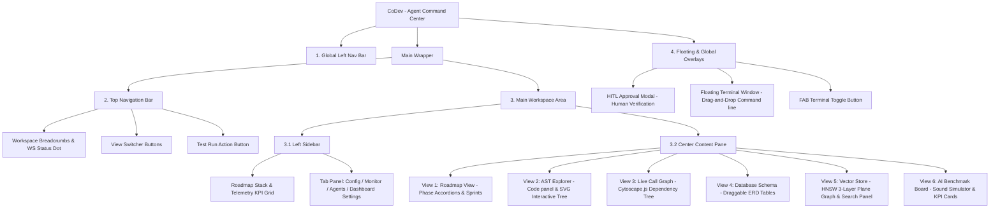

# Site Map of Untitled-1.html (CoDev - Agent Command Center)

**File Path:** [G:\covibe\Untitled-1.html](file:///G:/covibe/Untitled-1.html)
**Purpose:** Multi-view developer command center dashboard interface for CoVibe development.

---

## 1. Visual Navigation Map (Mermaid Diagram)



---

## 2. Hierarchical Tree Structure (โครงสร้างแบบแผนภูมิต้นไม้)

โครงสร้างการจัดวางคอมโพเนนต์และลำดับชั้นหน้าจอควบคุม (DOM Hierarchy Layout):

```text
CoDev - Agent Command Center (Untitled-1.html)
├── 1. Global Left Navigation Bar (แถบเมนูด้านซ้ายสุด)
│   ├── App Logo (โลโก้หลัก)
│   ├── AST Viewer Button (ปุ่มทางลัดสลับมุมมอง AST)
│   ├── Roadmaps Button (ปุ่มทางลัดสลับมุมมองบอร์ด)
│   ├── Agent Hub Button (ปุ่มทางลัดสลับมุมมองเอเจนต์)
│   ├── Knowledge Base Button (ปุ่มทางลัดสลับมุมมองฐานข้อมูล)
│   ├── Settings Button (ปุ่มตั้งค่าด่วน)
│   └── User Avatar (ภาพโปรไฟล์ผู้ใช้งาน)
├── 2. Top Navigation Bar (แถบเมนูด้านบนสุด)
│   ├── Breadcrumbs (ระบุพิกัด CoDev Workspace > CoVibe)
│   ├── WebSocket Connection Status Dot (ไฟบอกสถานะพอร์ต 8787)
│   ├── View Switcher Buttons (แถบเปลี่ยนมุมมองหลัก 6 รูปแบบ)
│   │   ├── Roadmap View Button
│   │   ├── AST Explorer View Button
│   │   ├── Call Graph View Button
│   │   ├── Database View Button
│   │   ├── Vector Store View Button
│   │   └── Benchmark View Button
│   └── Top Actions (ปุ่มเรียกคำสั่งจำลอง Test Run)
├── 3. Main Workspace Area (พื้นที่หน้าจอหลัก)
│   ├── 3.1 Left Sidebar (แผงควบคุมฝั่งซ้าย - แสดงใน Roadmap & Benchmark)
│   │   ├── Roadmap Stack (แถบเปอร์เซ็นต์ความคืบหน้าโครงการและ Telemetry KPIs)
│   │   └── Tab Panel Sub-menus (ระบบแท็บตั้งค่า/ประมวลผลย่อย)
│   │       ├── Config Tab (ตั้งค่า Prompt และ Path)
│   │       ├── Monitor Tab (แสดงประวัติการเรียกทำงาน Execution Trace)
│   │       ├── Agents Tab (ตรวจสอบสถานะ Agent Roster)
│   │       └── Settings Tab (เปลี่ยนธีม Midnight/OLED/Cyberpunk/Forest, ลิมิตความร้อน, ปริมาณเสียง)
│   └── 3.2 Center Content Pane (แผงกลางแสดงมุมมองตามที่เลือก)
│       ├── Roadmap View (พื้นที่แสดงการ์ด Phase 0-4 และ Sprint งานย่อย)
│       ├── AST Explorer View (มุมมองแยก: Code Panel และ AST Tree Canvas ที่ลากย้ายได้)
│       ├── Call Graph View (มุมมองแสดงผัง Dependency Cytoscape.js และกล่องข้อมูลข้างขวา)
│       ├── Database View (มุมมองแยก: แท็บฟังก์ชันฐานข้อมูล และ ERD Canvas แสดงตารางสัมพันธ์)
│       ├── Vector Store View (มุมมองแยก: ตัวป้อนคำสืบค้น, กราฟ HNSW 3 ชั้น, และผลการคำนวณ)
│       └── AI Benchmark View (มุมมองแยก: ชุดปุ่มโมเดล, เครื่องเล่น Waveform sandbox, และชาร์ตวิเคราะห์ความร้อน)
└── 4. Overlays & Floating Components (ส่วนแสดงผลทับซ้อนและหน้าต่างลอย)
    ├── HITL Verification Modal (กล่องอนุมัติ Human-In-The-Loop สำหรับยืนยันไวยากรณ์)
    ├── FAB Terminal Button (ปุ่มลอยสำหรับเปิด/ปิด Terminal)
    └── Floating Terminal Window (หน้าต่างเชลล์คำสั่งที่เคลื่อนย้ายได้ พร้อมแถบสลับโหมดคำสั่ง)
```

---

## 3. Interface Navigation & Layout Breakdown

### 2.1 Global Left Navigation Bar (`nav`)
- **App Logo:** Codesandbox Brand Icon (`ti-brand-codesandbox`)
- **Quick Links:**
  - **AST Viewer:** Icon (`ti-hierarchy-2`)
  - **Roadmaps:** Icon (`ti-layout-kanban`)
  - **Agent Hub:** Icon (`ti-users`)
  - **Knowledge Base:** Icon (`ti-database`)
- **Settings & User Profile:** Settings cog button (`ti-settings`) and avatar placeholder.

### 2.2 Top Navigation Bar (`header`)
- **Breadcrumbs:** `CoDev Workspace > CoVibe`
- **Connection Status:** WebSocket server status indicator dot (Default port: `8787`).
- **Main View Switcher:** Buttons to switch active views in the center panel:
  - **Roadmap:** `roadmap` view
  - **AST:** `canvas` view
  - **Call Graph:** `callgraph` view
  - **Database:** `database` view
  - **Vector Store (HNSW):** `vector` view
  - **Benchmark:** `benchmark` view
- **Actions:** **Test Run** button (`ti-player-play`) which starts the AST Traversal animation.

### 2.3 Left Sidebar (`aside#left-sidebar`)
*Only active when the Roadmap or Benchmark views are selected.*
- **Roadmap Progress & Metrics:**
  - Global project progress percentage, stats count (Total, Done, Pending, Phase).
  - Telemetry KPIs: Spend ($), Calls, Tools, Forecast ($), Input/Output Tokens, time, and GPU temperature.
- **Tab Panel Sub-menus:**
  - **Config (`tab-settings`):** System prompt setting and workspace path.
  - **Monitor (`tab-monitor`):** Execution trace list.
  - **Agents (`tab-agents`):** Agent roster status (EVA-cli, Qwen Coder, Local Dev).
  - **Settings (`tab-dashboard-settings`):** UI Theme selection, Autoplay Assist toggle, Telemetry interval poll frequency, GPU thermal safety caution limit, and synthesizer volume control.

### 2.4 Center Content Pane (`main > section`)

#### 1) Roadmap View (`#roadmap-view`)
Organizes CoVibe features into phase-based accordions:
- **Phase 0: Technical Spike:** YouTube API integration, WebSocket room proof of concept.
- **Phase 1: MVP Core:** React/Vite project setup, WebSocket backend room state, QR code generation, room join flow.
- **Phase 2: Sync Calibration:** Playback speed adjustments, background playback handling, OLED Saver.
- **Phase 3: Beta Test & Real Rider Feedback:** WebRTC voice channel spike, telemetry logs, feedback forms.
- **Phase 4: Post-Beta Expansion:** Hotspot direct connection, intercom voice chat, convoy GPS, voice commands.
- **Sprint / Tasks structure:** Task items support status verification checkboxes (`Doc`, `Code`, `Test`), assignee selection (`Assist`), and status badges (`Waiting`, `Done`).

#### 2) AST Explorer (`#workflow-canvas`)
- **AST Code Viewer:** Left pane displaying code snippet `calculateDrift.js` with code line highlighters.
- **AST Canvas:** Right pane containing tree nodes (`Program`, `FunctionDeclaration`, `BinaryExpression`, `CallExpression`) connected via dynamic SVG curves.

#### 3) Live Call Graph View (`#callgraph-view`)
- **Toolbar:** Database connection metadata, depth level selector (All, 1, 2, 3+), "Sync Tree-sitter" action button.
- **Cytoscape Graph Area:** Interactive tree view displaying dependencies grouped into parent packages (`apps/web`, `packages/msp`, `packages/gks`).
- **Floating Details Panel:** Node file details, inbound/outbound call lists.

#### 4) Database Schema View (`#database-view`)
- **Management Sidebar:** Database sections (Tables, Functions, Triggers, Replication, Backups).
- **Interactive ERD Canvas:** Drag-and-drop table layouts (`transactions`, `orders`, `conversations`, `tasks`, `employees`) with SVG path connectors.

#### 5) Vector Store View (`#vector-view`)
- **Control Panel:** Input query field, new document ingestion form, rebuild index graph actions, similarity parameters.
- **HNSW Visualizer:** Visual 3-plane HNSW graph structure (Layer 2 Skip lane, Layer 1 Sub-express, Layer 0 Base KNN) displaying node greedy traversal paths.
- **Search Results:** Scoring matched items by Cosine Similarity rankings.

#### 6) AI Benchmark Dashboard (`#benchmark-view`)
- **KPI Metrics:** Task in Focus, Champion Speed, GPU clock safety, Token Efficiency, Failed Runs.
- **Sound Simulator Sandbox:** Web Audio API synth generator producing sine waveforms rendered dynamically on an HTML5 canvas oscilloscope.
- **Overview & Performance:** Detailed champion lists comparing tokens/sec output across different LLM backends (Qwen, Ollama, Gemini).

### 3.5 Overlays & Dialogs
- **Human-In-The-Loop Modal (`#hitl-modal`):** Halt/Verify prompt overlay to authorize AST execution paths.
- **Floating Terminal Window (`#floating-terminal`):** WebSocket terminal shell trace supporting multiple environments (Gemini, System, EVA, Qwen). Activated/toggled by the floating terminal button (`#fab-terminal`).

---

## 4. Top-Nav to Side-Nav State Dependency (ความสัมพันธ์การทำงานของเมนูด้านบนและเมนูด้านข้าง)

ระบบจะควบคุมการแสดงผลของแถบเมนูด้านข้าง (Side Nav / Left Sidebar) และคอมโพเนนต์ย่อยด้านใน (Child components) ตามตัวเลือกที่ถูกเปิดใช้งานบนแถบสวิตช์มุมมองด้านบน (Top Nav View Switcher) ผ่านฟังก์ชัน `switchMainView(view)` โดยมีความสัมพันธ์เชิงตรรกะ (Logical State Dependency) ดังนี้:

### ตารางความเกี่ยวข้องการแสดงผล (State Mapping Table)

| Top Nav View (Parent) | Left Sidebar State | Sidebar Active Stack (Child) | Content View Panel |
| :--- | :--- | :--- | :--- |
| **Roadmap** | 🟢 แสดงผล (`block`) | `#left-sidebar-roadmap` | `#roadmap-view` |
| **AST (Explorer)** | 🔴 ซ่อน (`hidden`) | *ไม่มี* | `#workflow-canvas` |
| **Call Graph** | 🔴 ซ่อน (`hidden`) | *ไม่มี* | `#callgraph-view` |
| **Database** | 🔴 ซ่อน (`hidden`) | *ไม่มี* | `#database-view` |
| **Vector Store** | 🔴 ซ่อน (`hidden`) | *ไม่มี* | `#vector-view` |
| **Benchmark** | 🟢 แสดงผล (`block`) | `#left-sidebar-benchmark` | `#benchmark-view` |

### รายละเอียดการซิงค์ตรรกะ (Logical Sync Behavior)

1. **การควบคุมการซ่อน/แสดงแผงข้าง (Left Sidebar Toggle)**
   - เมื่อสลับไปยังมุมมอง **Roadmap** หรือ **Benchmark**: ระบบจะเรียก `leftSidebar.classList.remove('hidden')` เพื่อกางแผงควบคุมฝั่งซ้ายออก
   - เมื่อสลับไปยังมุมมองด้านความสัมพันธ์หรือทางเทคนิคอื่นๆ (**AST, Call Graph, Database, Vector Store**): ระบบจะปิดพื้นที่แผงข้างด้วย `leftSidebar.classList.add('hidden')` เพื่อเพิ่มขนาดความกว้างให้กับหน้าต่างทำกิจกรรมหลัก (Interactive Canvas)
2. **การสับเปลี่ยนชุดข้อมูลในแผงข้าง (Sidebar Child Stack)**
   - **เมื่อกางแผงในมุมมอง Roadmap**: ตัวควบคุมหลักจะทำการปิดมุมมองแผงฝั่ง Benchmark และเปิดแสดงเฉพาะ `#left-sidebar-roadmap` ซึ่งบรรจุระบบติดตามความคืบหน้าโครงการและแท็บการประเมินผล EVA/Qwen Coder
   - **เมื่อกางแผงในมุมมอง Benchmark**: ตัวควบคุมจะปิดการแสดงแผง Roadmap และดึงเฉพาะชุดข้อมูลตรวจสอบเซ็นเซอร์ฮาร์ดแวร์และการรันคะแนนโมเดล AI ขึ้นมาแสดง

